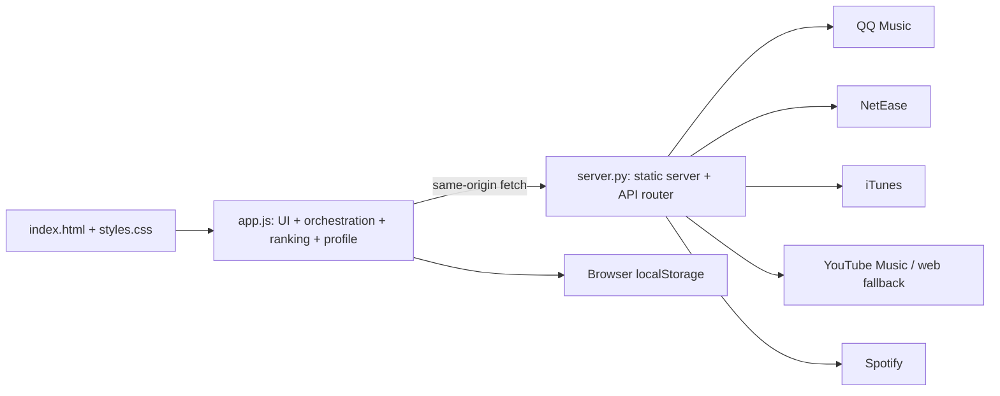
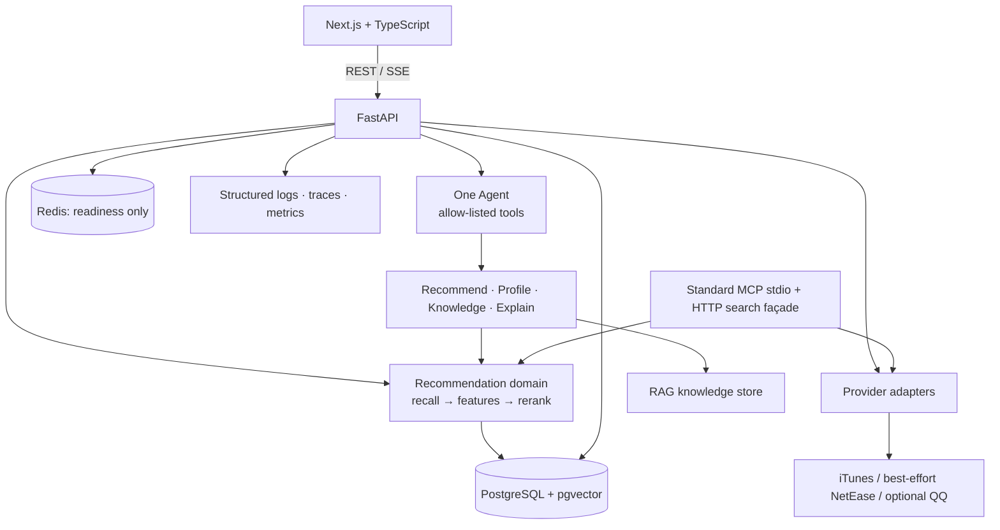
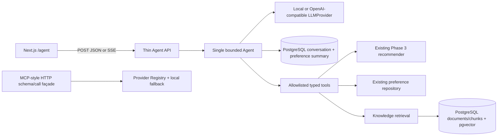

# Architecture / 架构

## Purpose / 目标

Music Recommendation Platform is a portfolio-grade, maintainable web application.
Its recommendation engine remains deterministic and measurable; the Agent interprets
requests, selects tools, and explains results rather than replacing the recommender.

## Legacy baseline audit (before Phase 1) / 旧版基线审查



- `app.js` is a 3,858-line single module. It starts a recommendation from input/language/private
  radio, resolves an original artist (including modal confirmation), creates provider search plans,
  fetches and normalizes results, scores/deduplicates/diversifies them, persists browser data, and
  renders/animates cards.
- `server.py` is a 1,034-line standard-library static server and HTTP proxy. It exposes six GET
  endpoints, maps provider-specific payloads, discovers YouTube web keys, optionally obtains a
  Spotify token from environment variables, scrapes web-search fallbacks, and holds a process-local
  TTL cache (600 seconds, maximum 256 entries).
- The front-end profile is a weighted map of language/type/tag/artist/provider plus liked/blocked
  song keys. Mood, novelty, popularity, online song pool, recent other-artist history, runtime
  artist names, and display metrics are all localStorage state.

### Reusable legacy logic

Canonical song field mapping, safe URL/HTML handling, provider failure degradation, title/artist
matching, genre/language inference, deduplication, diversity constraints, feedback weight updates,
and explanation composition should be migrated as independently tested domain functions.

### Coupling and engineering risks

1. Provider protocol knowledge, recommendation policy, local persistence, and DOM rendering share
   one JavaScript module, making behaviour difficult to test or reuse server-side.
2. Provider priority and domain policy are embedded in constants and heuristic branches; there is
   no versioned configuration or offline evaluation harness.
3. Static serving, API routing, cache, third-party IO, HTML scraping, and error transport are
   coupled in one Python class/function module. Current error text can expose upstream details.
4. Browser-only identity/profile state cannot survive devices or support durable evaluation.
5. Provider reliability is sensitive to undocumented/public endpoints and HTML parsing. Spotify's
   public-web-token fallback should not be a target-provider guarantee.
6. No typed contracts, migrations, tests, trace IDs, or structured observability exist yet.

## Target topology / 目标拓扑

```text
Next.js web (apps/web)
        | REST + Server-Sent Events
FastAPI API (services/api)
        |-- PostgreSQL + pgvector: catalog, anonymous users, feedback, embeddings
        |-- Redis: readiness dependency; cache/session use is future work
        |-- Provider plugins: canonical adapters with partial-failure handling
        |-- Recommender: recall -> feature scoring -> reranking -> explanations
        |-- Agent: intent -> approved tool calls -> streamed response
        |-- MCP: standard read-only stdio server plus the retained HTTP façade
        `-- Observability: structured logs, traces, metrics events
```



## Future directory structure / 目标目录

```text
apps/web/                    Next.js client
services/api/app/
  api/                       FastAPI routes and schemas
  domain/                    recommendation, profile, evaluation policy
  providers/                 source adapters and canonical mappers
  agent/                     single-Agent orchestration and tool registry
  rag/                       knowledge ingestion and retrieval
  observability/             logging, trace, metric adapters
services/api/tests/          unit, API integration, Agent tests
infra/                       docker, database migrations, local configuration
docs/                        specs, evaluation notes, runbooks
legacy/                      optional later home for preserved demo files
```

`index.html`, `app.js`, `styles.css`, and `server.py` are the legacy demo. They stay
available during migration and are not dependencies of the target runtime.

### Phase 1 implementation status (historical snapshot)

The Next.js TypeScript shell and FastAPI service are runnable. API routes use typed schemas and
delegate device creation to a service and SQLAlchemy repository. Configuration validates the
database and Redis URLs. PostgreSQL stores `device_users`; Alembic revision `0001_device_users`
creates that table and enables pgvector. Redis is connected by a bounded client and checked by
`GET /health/ready`; no cache behaviour exists yet. Compose defines web, API, PostgreSQL/pgvector,
and Redis with health dependencies. `POST /v1/recommendations` validates a seed and bounded limit,
then selects canonical songs from a small bundled fixture through the service and domain layers.
The Next.js page calls this endpoint at request time and renders the returned examples. Docker is
not installed on the current host, so Compose startup and a live PostgreSQL migration remain
unverified; the four-service topology and offline migration SQL were checked statically.

### Phase 2 implementation status (historical snapshot)

`app/domain/music.py` defines Track, Artist, optional Album, ProviderSource, provider
capabilities, structured errors, health and search results. `app/providers/` contains the
MusicProvider Protocol, bounded HTTP transport, iTunes and NetEase default adapters, optional
QQ adapter, and registry. Mapping occurs inside each adapter. A normalized title/artist
`canonical_key` is returned for future deduplication; Phase 2 neither deduplicates nor ranks.
Each search invokes sources sequentially with a four-second HTTP timeout, a 1 MB response cap,
and at most 25 results per source. Failures produce a per-source error and structured log event.

The API now exposes `GET /v1/providers`, `GET /v1/providers/health`, and
`GET /v1/tracks/search?q=...&limit=...`. Health reports the last adapter operation or `unknown`
before first use; it does not probe the network. The fixture recommendation endpoint is still
separate from live search. iTunes uses Apple's documented Search API. NetEase and QQ use
undocumented legacy web endpoints and are marked `unverified`; QQ is disabled by default.
Spotify and YouTube Music are not target-runtime adapters. Fixture tests prove parsing and
degradation without external network. A separate manual smoke search on 2026-09-29 returned one
track from each default provider; future availability remains unverified.

## Service boundaries / 服务边界

### Homepage seeded discovery (2026-10-05) / 首页歌曲发现

The homepage now calls additive `POST /v1/recommendations/discover`. Typed inputs bound seed to
120 characters, artist confirmation to 200, result limit to 1–10, and UI language to `en`/`zh`.
The deterministic service resolves exact recording titles before recalling artist and available
genre/tag context, with at most three registry operations and 25 results/provider/operation.
Verified title/artist hints for `我好想你` distinguish the 苏打绿 recording and its title/artist
aliases. Other multi-artist matches expose at most five canonical choices. Alternate recordings
are filtered before merging; song mode excludes the seed's versions and unrelated fixture fill.
Generic mood/genre requests retain the existing local catalog fallback and policy.

The seed is separate from ranked results. Explicit seed artist/genre/tag/language weights in
`app/domain/discovery.py` supplement the existing profile/source/popularity policy. The existing
recommendation REST/Agent/MCP entry points share the corrected deterministic service. Scores,
provenance and per-source errors remain visible; followup failures do not erase successful recall.

The discovery API permits four active requests/event loop and uses the existing four-slot worker
pool. Workers own their database sessions until completion, including after cancellation. Recall
has a 37-second waiting deadline; optional model guidance has eight seconds, within a 45-second
request deadline. Structured busy/timeout errors reveal no payloads. Guidance reuses the assistant's
`get_llm_provider` configuration and strict prose-only Answer schema. It receives bounded canonical
track summaries/factors and the current seed, without device IDs, private chat or full profiles.
No key uses local guidance; malformed/unavailable/timed-out model prose preserves ranked results.

The homepage stores only the selected interface language alongside its existing random device ID.
It translates UI labels, statuses, feedback and measured explanation factors, keeping canonical
music metadata and English theme headings intact. The shared card/profile components default to
English for existing consumers. Locale changes update existing states without reranking; model
prose in the previous language is replaced by local guidance until another search.

### Phase 3 recommendation core (implemented)

`app/services/recommendation.py` recalls bounded candidates from Provider Registry and the
committed local catalog. `app/domain/pipeline.py` normalizes and merges songs across providers,
preserving all source IDs, then extracts features, scores with one policy, applies deterministic
diversity penalties, and produces factor-based explanations. `POST /v1/recommendations` uses this
pipeline and returns canonical tracks, provenance, scores, breakdowns and per-source errors.
The local catalog supplies results when upstream providers fail. The core never calls an LLM.

`POST /v1/feedback` validates `X-Device-Id`, canonical track metadata, and like/dislike. The
PostgreSQL `track_feedback` primary key is `(device_id, track_key)`; an atomic upsert means the
latest rating replaces the earlier one. `user_preference_profiles` stores bounded, recency
weighted artist, genre, tag, and language affinity maps. Recommendations with a device header
load this profile and penalize disliked track keys. Migration `0002_feedback_profiles` creates
both tables; SQLite is used only for offline API/repository tests.

Migration `0003_embeddings` adds pgvector `vector(16)` columns to profile snapshots and the
`song_embeddings` table. A local SHA-256 feature hash creates deterministic song and preference
vectors; feedback writes both in the same transaction. `similar_songs` uses pgvector cosine
distance in PostgreSQL and a bounded in-process calculation in SQLite tests. Embeddings are a
minimal similarity capability and do not alter the deterministic recommendation score. The
versioned `evaluation_v1.json` fixture drives `python -m app.domain.evaluation`, reporting
precision at the case limit, rank lift, attribute diversity, and catalog coverage.

### Phase 4 product client (implemented)

`apps/web` is now a client-side Next.js recommendation experience. `lib/device.ts` creates a
random UUID-based ID once in browser localStorage; `lib/api.ts` sends it on every request and
centralizes JSON parsing, timeout, base URL, and structured errors. It is a preference linkage
identifier, not authentication. The browser calls the FastAPI service directly; local default
is `http://localhost:8000`, configurable at build time with `NEXT_PUBLIC_API_BASE_URL`.

The homepage submits a bounded seed and one of 3/5/10 result limits, renders canonical tracks
with source provenance and factor explanations, and treats individual provider failures as a
notice when ranked results remain. Feedback is optimistic with rollback on save failure; a
successful rating refreshes the profile and offers a fresh recommendation run. The client does
not rank or transform provider payloads. `GET /v1/profile` reads existing affinities and the
latest five feedback rows, returning up to five positive artists, genres, tags, and languages.
No migration or recommendation policy change was needed.

### Phase 5 controlled Agent (implemented; offline and browser verified)

`app/agent/` separates `core.py`, `tools.py`, `memory.py`, `prompts.py`, `schemas.py`, and
`providers.py`. API routes only validate and transport chat. `LLMProvider` is a replaceable
planning/answer interface. The local provider is a deterministic bilingual intent router, not
a model; the OpenAI-compatible adapter uses bounded Chat Completions JSON requests, validates
payloads and then validates the plan/answer schemas. No Key defaults to the local provider.
Requests to the official `api.deepseek.com` host explicitly disable thinking to fit the bounded
planner/answer deadlines. JSON output mode and strict response validation remain enabled.
Real model quality/compatibility is not inferred from mocked transport tests.



| Tool | Input | Output and boundary |
| --- | --- | --- |
| `get_user_profile` | empty object | top-five positive artist/genre/tag/language summary for the request's device |
| `recommend_tracks` | seed ≤120 chars, limit 1–10 | canonical pipeline items in their original order; no ranking override |
| `search_music_knowledge` | query ≤120 chars, limit 1–5 | cited knowledge chunks with document ID, category, text and retrieval score |
| `explain_recommendation` | empty object, after recommend | measured recommendation factors plus separately marked general listening guidance |

One validated plan has 1–4 distinct calls, executed sequentially; there is no replanning loop.
The default whole-turn deadline is 30 seconds (configurable 1–60), with at most four active
Agent requests per event loop. Excess requests receive `agent_busy`. Synchronous jobs also
have four slots retained until completion after cancellation; provider adapters retain their
existing four-second timeouts and result caps. LLM HTTP uses ten seconds, no retries/redirects,
a 64 KiB response cap and 1,200 output tokens. Agent database transactions set PostgreSQL
statement/lock timeouts of three/one seconds. Cancellation bounds the waiting request;
already-running synchronous work can finish, including an in-flight memory commit.

`0004_agent_memory` adds `agent_conversations` and `agent_preference_summaries`. Conversation
IDs are server-generated UUIDs bound to a device, retain the last 12 messages (six turns) and
the last recommendation seed. Version-checked updates reject simultaneous stale writes with
`conversation_conflict`. Preference summaries derive from Phase 3 feedback, not LLM guesses,
and refresh when `get_user_profile` runs. These rows survive process restarts; Redis is not
required for Agent context. Device identifiers provide linkage, not authenticated isolation.
There is no account system, conversation listing/deletion UI or automatic retention sweep.

`app/rag/` holds a versioned four-document fixture: artist, genre, album, explanation aid.
`0005_music_knowledge` seeds documents/chunks and `vector(16)`. A local SHA-256 text/bigram
encoder requires no model download or network. PostgreSQL uses cosine `<=>` retrieval with
at most 50 candidate chunks; lexical overlap guards hash collisions before final top-five
selection. SQLite uses the same score calculation for offline tests. Retrieval only grounds
answers/explanations; it never enters recommendation rank. This tiny bilingual fixture and
hash encoder are demonstration coverage, not a large semantic knowledge service.

`app/mcp/tools.py` has no Agent/LLM dependency. `GET /v1/mcp/tools` advertises `music_search`
with input/output JSON schemas and read-only annotations; `POST /v1/mcp/tools/call` returns
text content and canonical `structuredContent`. Search is unranked, limit 1–25, with a 15-second
route deadline and local fallback. This is an MCP-style HTTP façade inspired by the tools
contract, not a full interoperable MCP server: no JSON-RPC initialize, stdio or session transport.

`/agent` presents an input, the current page's last 12 chat entries, canonical recommendation
results, citations and public tool status. The browser sends the stable device ID in the body,
reuses returned conversation IDs within the page, and cancels streaming on unmount. The server
persists context; refreshing the page starts a new conversation because no history loader was
added. The SSE client handles fragmented UTF-8 frames, errors and interrupted streams.
320/768/1024/1440px layouts and recommendation/artist flows were checked in a real browser.
Live Docker/PostgreSQL execution remains unverified on this host.

### Phase 6 observability and release quality / 第六阶段

`app/observability/events.py` emits allowlisted JSON events to stderr. Pure ASGI middleware
generates/validates request IDs and W3C v00 trace IDs, returns correlation headers, and records
route templates, status and full-response duration including SSE. ContextVars survive async
and worker-thread boundaries. Provider/model HTTP requests forward correlation headers.
Registry events record every provider call and bounded result count; recommendation events
record candidate/result/source/failure counts and personalization, without logging seed or songs.
Agent events record tool/model/status/duration and stable error codes. OpenAI-compatible responses
may supply validated integer token counts; local routing reports no invented usage.

Logs never contain bodies, prompts/answers, device/conversation IDs, query URLs, sensitive headers,
credentials or exception messages. HTTP client logs are suppressed; the documented Uvicorn command
disables raw access logs. There is no collector, telemetry DB, histogram endpoint or alerting service.
The JSON duration/status samples support offline rate/error/percentile analysis. SSE can report a
terminal error after HTTP 200; observe `agent_error` as well as the HTTP status.

HTTP POST bodies are capped at 64 KiB with a ten-second receive deadline. Unexpected exceptions
return a generic `internal_error` envelope. Provider display URLs reject embedded credentials,
unsafe schemes and literal local/private IPs; the server only fetches fixed adapter URLs and the
operator-configured LLM endpoint, never a request-supplied URL. HTTPS DNS destinations still depend
on operator/network trust; this is not a universal DNS-rebinding defense. CORS remains explicit and
now exposes correlation headers. `ENABLE_MUSIC_PROVIDERS=false` uses an empty registry and the
existing local catalog, enabling business-network-free container and MCP verification.

`app/mcp/server.py` adds an official SDK v1.30.0 **standard stdio MCP server**, installed as the
optional `mcp` extra. It implements protocol lifecycle and discovery/calls through the SDK and
exposes `music_search` and unpersonalized `recommend_tracks`, with typed structured output and
read-only annotations. Search delegates to `MusicTools`; recommendation delegates to the same
deterministic recommendation service as REST/Agent. Fifteen-second tool deadlines and the existing
four-slot worker pool bound execution. MCP logs go to stderr with per-call correlation. A real
official client launches the subprocess, initializes, discovers and calls both tools in tests.
The Phase 5 `/v1/mcp` routes remain an MCP-style HTTP façade; no remote standard MCP HTTP/OAuth
transport is implemented. MCP has no Agent/LLM dependency or device-private profile access.

Compose runs web/API as non-root, binds only loopback web/API ports, orders readiness dependencies
and applies migrations before serving. API package discovery includes only `app` and explicitly
ships its fixture JSON. Web uses a build stage and a runtime with production dependencies. Environment
templates hold placeholders; Docker contexts exclude env/cache/build inputs. Five Alembic revisions
remain unchanged. CI runs pytest/Ruff/compile/migration SQL/evaluation/legacy/wheel checks, web tests,
lint/typecheck/build/audit and a disposable offline Compose clean start with real pgvector queries.

Author Windows host (2026-09-30) has no Docker: local container clean start is **not executed**;
static topology/Dockerfile/environment checks and full offline PostgreSQL upgrade/downgrade SQL
are separate evidence. See actual CI runs for remote runtime status. Real LLM compatibility was
unverified at that point. [Deployment](docs/DEPLOYMENT.md), [Demo](docs/DEMO.md), [Logs](docs/OBSERVABILITY.md).

Release audit on 2026-10-02: main `4c54239` passed the actual
[CI clean-start job](https://github.com/jiangking22/music_recommendation_system/actions/runs/36971477031/job/110726170498),
including PostgreSQL/pgvector, Redis, migrations and the offline product flow. This adds remote
runtime evidence without changing the historical local no-Docker status or architecture decisions.

On 2026-10-05, local Docker API/web rebuild and readiness passed against the existing PostgreSQL
and Redis stack. Live discovery and Agent chat used the configured DeepSeek-flash through the
shared adapter. This verifies that configuration, not other providers, general quality or a new
disposable local database clean start.

| Area | Responsibility | Must not do |
| --- | --- | --- |
| Web | Present UI, persist anonymous device ID, consume REST/SSE | Rank songs or store secrets |
| API | Validate requests, coordinate use cases, expose OpenAPI | Embed provider-specific HTTP details in routes |
| Provider | Convert an external source into the canonical song model | Make recommendation policy decisions |
| Recommender | Candidate recall, feature scoring, reranking, offline evaluation | Call an LLM |
| Agent | Intent extraction, tool choice, result composition | Invent song metadata or bypass access checks |
| MCP | Expose a small tool subset for compatible clients | Become a second business-logic implementation |

## Data ownership / 数据归属

- PostgreSQL stores device users, feedback/profiles, song vectors, Agent conversations,
  preference summaries and knowledge documents/chunks/vectors. Recommendation events are planned.
- Redis currently has a readiness check; future cache/rate-limit data is discardable.
- The browser retains a random anonymous device identifier. It is sent as `X-Device-Id`
  and is not an authentication credential.
- API keys are environment variables only. `.env` is never committed.

## Request paths / 关键请求路径

### Recommendation

1. The client sends `seed`, `limit`, and an anonymous device header to `POST /v1/recommendations`.
2. The API resolves the user preference profile and asks provider plugins plus local catalog
   for candidates.
3. The recommender deduplicates candidates, applies feature scores and diversity reranking.
4. The API returns songs, score factors, provider provenance, and an explanation.

### Agent chat

1. The client sends `message`, `device_id` and optional `conversation_id` to
   `POST /v1/agent/chat` (JSON) or `/v1/agent/chat/stream` (SSE).
2. The Agent loads the current session plus durable preference summary.
3. It validates one bounded plan, then invokes approved profile/recommend/knowledge/explain
   tools. Tool traces contain names and statuses; logs contain no chat content or credentials.
4. SSE sends `status` (分析需求 / 查询偏好 / 调用工具 / 返回结果), `tool_result`,
   `done` (the complete chat response), or `error` (the consistent error envelope).
   Internal reasoning is never streamed.

## Reliability and security / 可靠性与安全

- Provider failures are isolated and surfaced as partial-source metadata, never as a full
  recommendation outage when local candidates remain.
- Request models use explicit validation, bounded page sizes, and timeouts.
- External provider URLs and user-provided text are treated as untrusted input.
- Logs redact authorization headers, API keys, and user message contents by default.

## Verification architecture / 验证架构

- Unit tests cover provider mapping, scoring, reranking, profile updates, and Agent tool
  selection.
- API integration tests use disposable SQLite databases and mocked providers/LLM transport.
  PostgreSQL migration SQL is verified offline; the CI clean-start job also tests a live database.
- Offline recommendation evaluation reports relevance, personalization lift, diversity and coverage
  from versioned fixtures. Separate Agent tests assert tool selection; no accuracy benchmark is claimed.
- Docker Compose is the authoritative local end-to-end environment.
