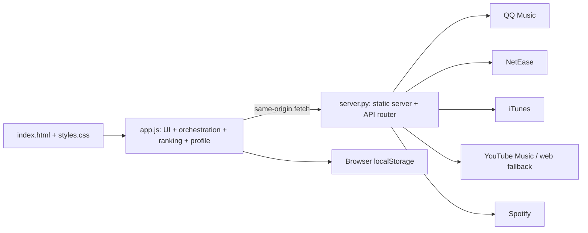
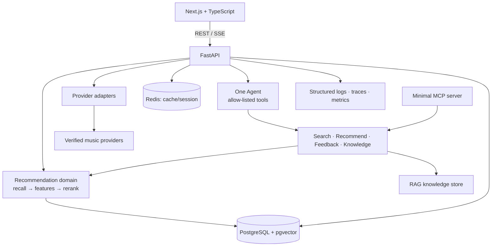

# Architecture / 架构

## Purpose / 目标

Music Recommendation Platform is a portfolio-grade, maintainable web application.
Its recommendation engine remains deterministic and measurable; the Agent interprets
requests, selects tools, and explains results rather than replacing the recommender.

## Current-state audit / 当前状态审查



- `app.js` is a 3,858-line single module. It starts a recommendation from input/language/private
  radio, resolves an original artist (including modal confirmation), creates provider search plans,
  fetches and normalizes results, scores/deduplicates/diversifies them, persists browser data, and
  renders/animates cards.
- `server.py` is a 1,034-line standard-library static server and HTTP proxy. It exposes six GET
  endpoints, maps provider-specific payloads, discovers YouTube web keys, optionally obtains a
  Spotify token from environment variables, scrapes web-search fallbacks, and holds a process-local
  TTL cache (600 seconds, maximum 256 entries).
- The front-end profile is a weighted map of language/type/tag/artist/provider plus liked/blocked
  song keys. Mood, novelty, popularity, online song pool, recent other-artist history, runtime
  artist names, and display metrics are all localStorage state.

### Reusable legacy logic

Canonical song field mapping, safe URL/HTML handling, provider failure degradation, title/artist
matching, genre/language inference, deduplication, diversity constraints, feedback weight updates,
and explanation composition should be migrated as independently tested domain functions.

### Coupling and engineering risks

1. Provider protocol knowledge, recommendation policy, local persistence, and DOM rendering share
   one JavaScript module, making behaviour difficult to test or reuse server-side.
2. Provider priority and domain policy are embedded in constants and heuristic branches; there is
   no versioned configuration or offline evaluation harness.
3. Static serving, API routing, cache, third-party IO, HTML scraping, and error transport are
   coupled in one Python class/function module. Current error text can expose upstream details.
4. Browser-only identity/profile state cannot survive devices or support durable evaluation.
5. Provider reliability is sensitive to undocumented/public endpoints and HTML parsing. Spotify's
   public-web-token fallback should not be a target-provider guarantee.
6. No typed contracts, migrations, tests, trace IDs, or structured observability exist yet.

## Target topology / 目标拓扑

```text
Next.js web (apps/web)
        | REST + Server-Sent Events
FastAPI API (services/api)
        |-- PostgreSQL + pgvector: catalog, anonymous users, feedback, embeddings
        |-- Redis: short-lived session and response cache
        |-- Provider plugins: stable music-source adapters
        |-- Recommender: recall -> feature scoring -> reranking -> explanations
        |-- Agent: intent -> approved tool calls -> streamed response
        |-- MCP server: a small, read-oriented façade over music tools
        `-- Observability: structured logs, traces, metrics events
```



## Future directory structure / 目标目录

```text
apps/web/                    Next.js client
services/api/app/
  api/                       FastAPI routes and schemas
  domain/                    recommendation, profile, evaluation policy
  providers/                 source adapters and canonical mappers
  agent/                     single-Agent orchestration and tool registry
  rag/                       knowledge ingestion and retrieval
  observability/             logging, trace, metric adapters
services/api/tests/          unit, API integration, Agent tests
infra/                       docker, database migrations, local configuration
docs/                        specs, evaluation notes, runbooks
legacy/                      optional later home for preserved demo files
```

`index.html`, `app.js`, `styles.css`, and `server.py` are the legacy demo. They stay
available during migration and are not dependencies of the target runtime.

### Phase 1 implementation status

The Next.js TypeScript shell and FastAPI service are runnable. API routes use typed schemas and
delegate device creation to a service and SQLAlchemy repository. Configuration validates the
database and Redis URLs. PostgreSQL stores `device_users`; Alembic revision `0001_device_users`
creates that table and enables pgvector. Redis is connected by a bounded client and checked by
`GET /health/ready`; no cache behaviour exists yet. Compose defines web, API, PostgreSQL/pgvector,
and Redis with health dependencies. `POST /v1/recommendations` validates a seed and bounded limit,
then selects canonical songs from a small bundled fixture through the service and domain layers.
The Next.js page calls this endpoint at request time and renders the returned examples. Docker is
not installed on the current host, so Compose startup and a live PostgreSQL migration remain
unverified; the four-service topology and offline migration SQL were checked statically.

### Phase 2 implementation status

`app/domain/music.py` defines Track, Artist, optional Album, ProviderSource, provider
capabilities, structured errors, health and search results. `app/providers/` contains the
MusicProvider Protocol, bounded HTTP transport, iTunes and NetEase default adapters, optional
QQ adapter, and registry. Mapping occurs inside each adapter. A normalized title/artist
`canonical_key` is returned for future deduplication; Phase 2 neither deduplicates nor ranks.
Each search invokes sources sequentially with a four-second HTTP timeout, a 1 MB response cap,
and at most 25 results per source. Failures produce a per-source error and structured log event.

The API now exposes `GET /v1/providers`, `GET /v1/providers/health`, and
`GET /v1/tracks/search?q=...&limit=...`. Health reports the last adapter operation or `unknown`
before first use; it does not probe the network. The fixture recommendation endpoint is still
separate from live search. iTunes uses Apple's documented Search API. NetEase and QQ use
undocumented legacy web endpoints and are marked `unverified`; QQ is disabled by default.
Spotify and YouTube Music are not target-runtime adapters. Fixture tests prove parsing and
degradation without external network. A separate manual smoke search on 2026-09-29 returned one
track from each default provider; future availability remains unverified.

## Service boundaries / 服务边界

### Phase 3 recommendation core (implemented)

`app/services/recommendation.py` recalls bounded candidates from Provider Registry and the
committed local catalog. `app/domain/pipeline.py` normalizes and merges songs across providers,
preserving all source IDs, then extracts features, scores with one policy, applies deterministic
diversity penalties, and produces factor-based explanations. `POST /v1/recommendations` uses this
pipeline and returns canonical tracks, provenance, scores, breakdowns and per-source errors.
The local catalog supplies results when upstream providers fail. The core never calls an LLM.

| Area | Responsibility | Must not do |
| --- | --- | --- |
| Web | Present UI, persist anonymous device ID, consume REST/SSE | Rank songs or store secrets |
| API | Validate requests, coordinate use cases, expose OpenAPI | Embed provider-specific HTTP details in routes |
| Provider | Convert an external source into the canonical song model | Make recommendation policy decisions |
| Recommender | Candidate recall, feature scoring, reranking, offline evaluation | Call an LLM |
| Agent | Intent extraction, tool choice, result composition | Invent song metadata or bypass access checks |
| MCP | Expose a small tool subset for compatible clients | Become a second business-logic implementation |

## Data ownership / 数据归属

- PostgreSQL is the system of record for songs, user profiles, feedback, recommendation
  events, knowledge documents, and embedding vectors.
- Redis holds only expirable session, cache, and rate-limit data; it is safe to clear.
- The browser retains a random anonymous device identifier. It is sent as `X-Device-Id`
  and is not an authentication credential.
- API keys are environment variables only. `.env` is never committed.

## Request paths / 关键请求路径

### Recommendation

1. The client sends a seed, filters, and anonymous device ID to `POST /v1/recommendations`.
2. The API resolves the user preference profile and asks provider plugins plus local catalog
   for candidates.
3. The recommender deduplicates candidates, applies feature scores and diversity reranking,
   then records an evaluation-friendly recommendation event.
4. The API returns songs, score factors, provider provenance, and an explanation.

### Agent chat

1. The client opens `POST /v1/agent/chat/stream` with a device ID and message.
2. The Agent loads the current session plus durable preference summary.
3. It calls an allow-listed tool (search, recommend, save feedback, music knowledge) when
   needed. Tool calls are traced.
4. The API streams typed SSE events: `message`, `tool_call`, `tool_result`, `done`, `error`.

## Reliability and security / 可靠性与安全

- Provider failures are isolated and surfaced as partial-source metadata, never as a full
  recommendation outage when local candidates remain.
- Request models use explicit validation, bounded page sizes, and timeouts.
- External provider URLs and user-provided text are treated as untrusted input.
- Logs redact authorization headers, API keys, and user message contents by default.

## Verification architecture / 验证架构

- Unit tests cover provider mapping, scoring, reranking, profile updates, and Agent tool
  selection.
- API integration tests use a disposable PostgreSQL/Redis environment.
- Offline evaluation reports relevance, personalization lift, diversity, coverage, and tool
  selection accuracy from versioned fixtures.
- Docker Compose is the authoritative local end-to-end environment.
