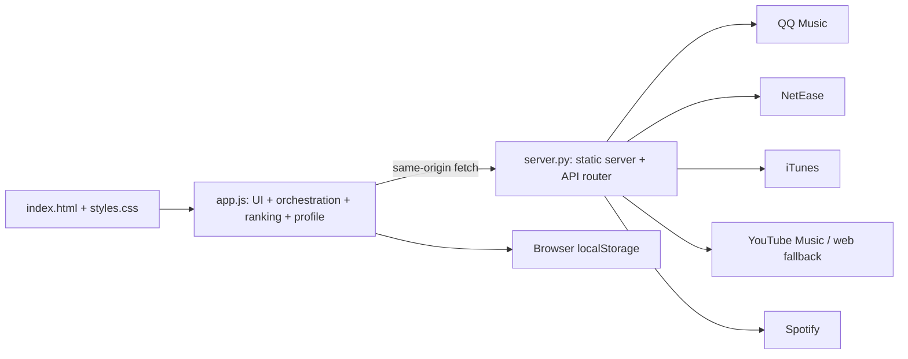
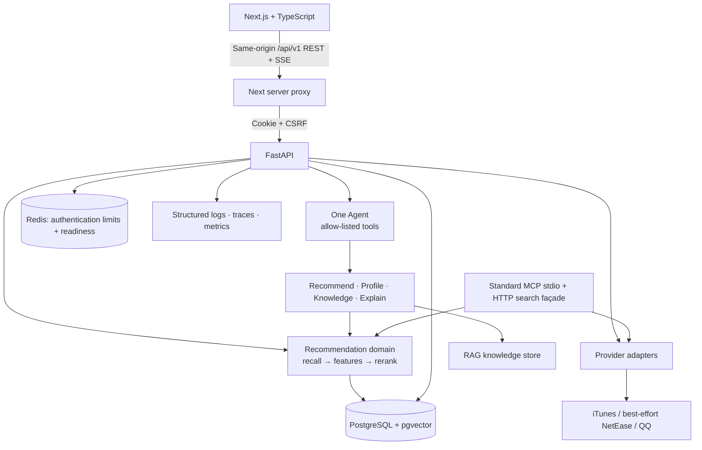
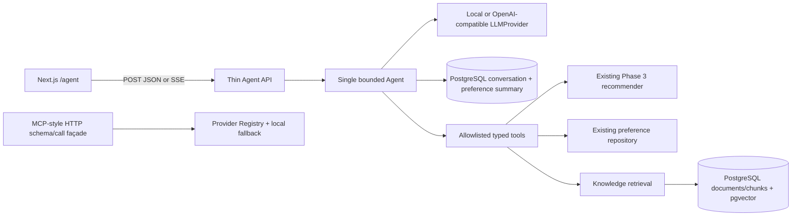

# Architecture / 架构

## Purpose / 目标

Progressive assistant discovery: task 1 implements match/mismatch/unknown listening constraints
and bounded structured model assistance for catalog-confirmed recordings (ADR-038). Model
evidence is exposed separately from Track metadata; explicit source conflicts cannot be overridden.
Task 2 adds a bounded JSON search_state column to account_conversations (migration 0009).
It keeps canonical candidates/evidence/query records independently of the six-turn model history,
reuses fresh qualifying candidates, and excludes session-shown songs for more-song requests.
Task 3 implements deterministic asynchronous recall stages: up to three distinct platform rounds,
optional TW/HK search, exact MusicBrainz metadata and up to two Brave queries. Provider/attribute/
web-clue calls share a 24-operation/45-second budget. Results are merged then ranked by existing
policy, with partial counts/reasons and verified web references returned additively in JSON/SSE.
Cancellation prevents scheduling additional operations; an in-flight synchronous request may finish.
Ordinary/deep request deadlines are 90/120 seconds. No Brave key is configured on this host.
Task 4 exposes optional reports/evidence/references through compatible JSON/SSE responses and
shows actual stages and partial reasons. Capability metadata separates catalog, Brave and native
model search. Browser deadlines are 100/130 seconds; proxy lifetime remains 140 seconds.
Full pools protect qualifying old matches and admit new recall ahead of stale nonmatches.
Original recording metadata survives storage; attribute filtering precedes deduplication so one
version cannot donate its tags to another. Generic recall may request structured artist/title
clues from the model, counted against the same search budget. Sadness and calmness can coexist.
曲库属性缺失进入未知状态；模型辅助属性明确标注为推断，不修改曲库元数据或评分。

Account addition (implemented; verification recorded in docs/DEPLOYMENT.md): authenticated HTTP business access,
PostgreSQL accounts/revocable sessions, Redis authentication limits and same-origin web transport.
Account feedback/profiles replace anonymous device linkage for new requests. Assistant context
belongs to account plus login session; anonymous rows remain archived. See ADR-029 and
`docs/specs/account-login.md`; the standalone legacy demo remains runnable.
Usernames and passwords require 6–20 characters inclusive (ADR-032); usernames remain
case-insensitively unique and password length counts Unicode characters.

Sonora is a portfolio-grade, maintainable web application.
Its recommendation engine remains deterministic and measurable; the Agent interprets
requests, selects tools, and explains results rather than replacing the recommender.

## Legacy baseline audit (before Phase 1) / 旧版基线审查



- `app.js` is a 3,858-line single module. It starts a recommendation from input/language/private
  radio, resolves an original artist (including modal confirmation), creates provider search plans,
  fetches and normalizes results, scores/deduplicates/diversifies them, persists browser data, and
  renders/animates cards.
- `server.py` is a 1,034-line standard-library static server and HTTP proxy. It exposes six GET
  endpoints, maps provider-specific payloads, discovers YouTube web keys, optionally obtains a
  Spotify token from environment variables, scrapes web-search fallbacks, and holds a process-local
  TTL cache (600 seconds, maximum 256 entries).
- The front-end profile is a weighted map of language/type/tag/artist/provider plus liked/blocked
  song keys. Mood, novelty, popularity, online song pool, recent other-artist history, runtime
  artist names, and display metrics are all localStorage state.

### Reusable legacy logic

Canonical song field mapping, safe URL/HTML handling, provider failure degradation, title/artist
matching, genre/language inference, deduplication, diversity constraints, feedback weight updates,
and explanation composition should be migrated as independently tested domain functions.

### Coupling and engineering risks

1. Provider protocol knowledge, recommendation policy, local persistence, and DOM rendering share
   one JavaScript module, making behaviour difficult to test or reuse server-side.
2. Provider priority and domain policy are embedded in constants and heuristic branches; there is
   no versioned configuration or offline evaluation harness.
3. Static serving, API routing, cache, third-party IO, HTML scraping, and error transport are
   coupled in one Python class/function module. Current error text can expose upstream details.
4. Browser-only identity/profile state cannot survive devices or support durable evaluation.
5. Provider reliability is sensitive to undocumented/public endpoints and HTML parsing. Spotify's
   public-web-token fallback should not be a target-provider guarantee.
6. No typed contracts, migrations, tests, trace IDs, or structured observability exist yet.

## Target topology / 目标拓扑

```text
Next.js web (apps/web)
        | REST + Server-Sent Events
FastAPI API (services/api)
        |-- PostgreSQL + pgvector: accounts, sessions, account feedback/profile, embeddings, archived anonymous rows
        |-- Redis: readiness and authentication rate-limit counters; caching is future work
        |-- Provider plugins: canonical adapters with partial-failure handling
        |-- Recommender: recall -> feature scoring -> reranking -> explanations
        |-- Agent: intent -> approved tool calls -> streamed response
        |-- MCP: standard read-only stdio server plus the retained HTTP façade
        `-- Observability: structured logs, traces, metrics events
```



## Future directory structure / 目标目录

```text
apps/web/                    Next.js client
services/api/app/
  api/                       FastAPI routes and schemas
  domain/                    recommendation, profile, evaluation policy
  providers/                 source adapters and canonical mappers
  agent/                     single-Agent orchestration and tool registry
  rag/                       knowledge ingestion and retrieval
  observability/             logging, trace, metric adapters
services/api/tests/          unit, API integration, Agent tests
infra/                       docker, database migrations, local configuration
docs/                        specs, evaluation notes, runbooks
legacy/                      optional later home for preserved demo files
```

`index.html`, `app.js`, `styles.css`, and `server.py` are the legacy demo. They stay
available during migration and are not dependencies of the target runtime.

### Phase 1 implementation status (historical snapshot)

The Next.js TypeScript shell and FastAPI service are runnable. API routes use typed schemas and
delegate device creation to a service and SQLAlchemy repository. Configuration validates the
database and Redis URLs. PostgreSQL stores `device_users`; Alembic revision `0001_device_users`
creates that table and enables pgvector. Redis is connected by a bounded client and checked by
`GET /health/ready`; no cache behaviour exists yet. Compose defines web, API, PostgreSQL/pgvector,
and Redis with health dependencies. `POST /v1/recommendations` validates a seed and bounded limit,
then selects canonical songs from a small bundled fixture through the service and domain layers.
The Next.js page calls this endpoint at request time and renders the returned examples. Docker is
not installed on the current host, so Compose startup and a live PostgreSQL migration remain
unverified; the four-service topology and offline migration SQL were checked statically.

### Phase 2 implementation status (historical snapshot)

`app/domain/music.py` defines Track, Artist, optional Album, ProviderSource, provider
capabilities, structured errors, health and search results. `app/providers/` contains the
MusicProvider Protocol, bounded HTTP transport, iTunes and NetEase default adapters, optional
QQ adapter, and registry. Mapping occurs inside each adapter. A normalized title/artist
`canonical_key` is returned for future deduplication; Phase 2 neither deduplicates nor ranks.
Each search invokes sources sequentially with a four-second HTTP timeout, a 1 MB response cap,
and at most 25 results per source. Failures produce a per-source error and structured log event.

The API now exposes `GET /v1/providers`, `GET /v1/providers/health`, and
`GET /v1/tracks/search?q=...&limit=...`. Health reports the last adapter operation or `unknown`
before first use; it does not probe the network. The fixture recommendation endpoint is still
separate from live search. iTunes uses Apple's documented Search API. NetEase and QQ use
undocumented legacy web endpoints and are marked `unverified`; QQ is disabled by default.
Spotify and YouTube Music are not target-runtime adapters. Fixture tests prove parsing and
degradation without external network. A separate manual smoke search on 2026-09-29 returned one
track from each default provider; future availability remains unverified.

## Service boundaries / 服务边界

### Homepage seeded discovery and recording resolution / 首页

Every model-derived artist now requires user confirmation, including initial discovery. A matched
model seed returns `requires_confirmation=true`, its canonical recording/reference and empty
`items`; related recall and ranking do not run yet. Both model branches share the confirmation UI.
Users may supply a different artist, verified through the recording resolver with automatic
platform selection by default. Selecting that verified recording sends its reference and explicit
artist to discovery; revalidation, confirmed memory and deterministic ranking then proceed.

首次模型识别也先确认歌手再推荐。可点“不是这位歌手，我来填写”，输入歌手并自动检索曲库，核实后确认采用。
输入修改会清除旧录音的确认按钮；取消、过期响应与请求预算仍沿用原机制，未确认不写成功记录。

The homepage, **None of the above**, and manual source recovery share a recording resolver.
It revalidates confirmed success records first, then searches Apple, NetEase and QQ, followed
by Apple Taiwan/Hong Kong and MusicBrainz. Queries use bounded artist-qualified forms,
reviewed aliases and normalized punctuation. Identical platform/region/query combinations
are not repeated. Expansion stops when a matching title/artist recording is found; covers,
live versions and unrelated titles do not qualify. Catalog presence does not certify authorship.

首页、**以上均没有** 和人工补查共用录音解析服务。依次重新核实成功记录、检索 Apple／网易云／QQ，
再扩展 Apple 台湾／香港与 MusicBrainz；使用歌名、歌名＋歌手、已审核别名与规范化标点，避免重复查询。
核实命中后停止扩展；同名不同歌手、明确翻唱或现场版本不会冒充匹配。曲库存在性不等于原唱认证。

MusicBrainz provides recording metadata, not playback; requests share a one-per-second limiter
and an identifying User-Agent ([API documentation](https://musicbrainz.org/doc/MusicBrainz_API)).
Kugou and Kuwo are explicitly **unavailable**, rather than reported as searched: on 2026-10-06
the former failed to connect and the latter rejected the public request. They have no enabled
adapter. Each report distinguishes returned recordings, empty results, errors, authorization,
unconfigured sources and sources not executed. An incomplete budget or source failure never
means that the song does not exist.

MusicBrainz 仅核对录音元数据，界面明确说明不提供播放。酷狗连接失败、酷我公开请求被拒绝，当前均标为
**暂不可用**，未启用适配器。报告分别列出返回录音、无结果、故障、需要授权、未配置和未执行；预算用尽
或网络故障显示“检索尚未完成”。最终未命中提示：**未在已检索平台找到该歌曲，请检查歌名、歌手或来源链接。**

Optional `BRAVE_SEARCH_API_KEY` enables a maximum of five web clues per search. It is disabled
without its own server-side key ([Brave authentication](https://api-dashboard.search.brave.com/documentation/guides/authentication)).
Snippets are never recordings: registered provider detail lookup must return matching canonical
metadata. The server parses only supported HTTPS song links; it never fetches the supplied URL,
follows a redirect, runs webpage code or trusts model-generated recording IDs.

可选 `BRAVE_SEARCH_API_KEY` 为独立服务端 Key，不配置时默认关闭网页搜索。摘要仅为线索；必须读取已接入
平台的真实详情数据才能形成录音。用户链接仅解析受支持域名与录音 ID，服务端调用固定平台接口，不直接
抓取输入 URL、跟随重定向或执行网页代码。现支持 Apple US/TW/HK、网易云歌曲链接、QQ songDetail 链接
和 MusicBrainz recording 链接；其他平台／链接格式明确提示暂不支持。

Automatic discovery has a 45-second total deadline, at most one model call (8 seconds), and
24 external requests (one reserved for the optional model; reports count catalog/web calls).
Music work has a 37-second deadline; expansion reserves four requests
for deterministic related recall. Providers run sequentially within one request (below the
maximum of two); all HTTP catalog/web calls share four global outbound slots. Discovery,
identification and manual recovery share four active request slots and the existing bounded
worker pool. Each adapter retains four-second timeouts, a 1 MB response cap and 25 recordings.
Manual recovery has 30 seconds and six external requests, without automatic retry loops.

自动流程总限时 45 秒、模型最多一次且限时 8 秒、外部请求最多 24 次，其中为模型预留一次，报告计数为曲库／
网页请求。曲库工作限时 37 秒，扩展预留四次
请求用于确定性召回。每请求顺序调用来源，满足最多两个来源并发的上限；全局外部 HTTP 并发最多四个。
三个入口共享四个请求槽与有界工作池。适配器保留 4 秒超时、1 MB 响应与每来源 25 首上限；人工补查
限时 30 秒、最多六次外部请求，不自动循环重试。日志仅记录关联 ID、来源、阶段、状态、计数、耗时和错误码。

`POST /v1/recordings/resolve` accepts `seed` (1–120 trimmed characters), optional `artist`
(1–200), `language=en|zh`, optional `platform` (1–40) and `song_url` (1–2048).
It returns `status=matched|ambiguous|not_found|unsupported_platform|unavailable|incomplete`,
nullable `matched_track`/`resolution_id`, bounded candidate tracks with their references,
`search_report` and canonical `sources`. It performs no recommendation or model call.
Discovery and identify-original add `search_report` and nullable `resolution_id`; discovery
also returns `candidate_resolutions`. Identification retains its existing model error codes.

新增解析接口不调用模型、不生成推荐。发现／补充识别响应增加 `search_report` 与 `resolution_id`，
多版本候选分别附带确认引用。报告包含平台、地区、阶段、操作、状态、数量、安全错误码、请求计数和结束原因。
旧参数 `seed_artist`、`seed_storefront=TW|HK` 继续兼容。

The UI retains the original query and model suggestion. Unresolved results offer a platform
selector, optional artist and song-link field; multiple recordings require a choice, and a single
recording still requires **Confirm and recommend**. Confirmation sends `resolution_id` plus
`seed_artist` to discovery. The server re-fetches the same provider ID before deterministic recall
and ranking. Expired, mismatched or unavailable references return `resolution_expired` (410),
`resolution_mismatch` (422) or `resolution_unavailable` (503). New searches cancel pending UI
lookups; late results cannot replace the next query. English and Chinese copy cover the flow.

未命中时保留原查询／模型建议／历史报告，并提供指定来源补查。单个或多个真实录音均先展示来源并等待确认，
确认携带引用后从原命中平台重新核实，再由原推荐器召回和排序。重复提交被禁用，新查询取消旧请求，迟到
响应不会覆盖新结果；失效确认可重新检索，不强行推荐。

Migration `0006_recording_resolution` adds `recording_resolutions` (30-minute verification
references, expired rows pruned when new references are issued) and `verified_recordings`
(canonical title, artist identity, platform, real recording ID, URL, region and verification time).
Only a fresh provider verification plus explicit reference confirmation upserts success memory.
Guesses, failed lookups and unconfirmed tracks are never saved as durable facts. Future searches
revalidate remembered IDs; missing IDs are marked stale and other platforms are searched. Homonyms
remain separate. This is successful-result memory, not model training or global original-author certification.

迁移新增临时核实引用和成功录音表；仅“平台核实成功＋用户明确确认采用”写入成功记录。下次优先重查该
平台与 ID，失效记录标为待核实并继续扩展；同名不同歌手分别存储。此机制不训练模型、不建立原唱认证，
不修改评分规则。现有 Compose API 启动流程执行 Alembic 迁移；升级应保留现有 `.env` 和数据库卷。

The legacy `python server.py` demo remains unchanged. Synchronous recommendation REST/Agent/MCP
retain their existing bounded registry contract and deterministic theme behavior; expanded resolution
belongs to the homepage and recording endpoints. Automated tests mock providers/models; live source,
model and browser checks are recorded separately and do not establish universal coverage or accuracy.

旧版演示保持可运行；原同步推荐、Agent 和 MCP 的现有契约／主题处理保持兼容。自动测试模拟平台和模型，
真实平台、已配置模型与浏览器验收单独记录；不能保证所有歌曲均被收录或始终可访问。

### Phase 3 recommendation core (implemented)

`app/services/recommendation.py` recalls bounded candidates from Provider Registry and the
committed local catalog. `app/domain/pipeline.py` normalizes and merges songs across providers,
preserving all source IDs, then extracts features, scores with one policy, applies deterministic
diversity penalties, and produces factor-based explanations. `POST /v1/recommendations` uses this
pipeline and returns canonical tracks, provenance, scores, breakdowns and per-source errors.
The local catalog supplies results when upstream providers fail. The core never calls an LLM.

`POST /v1/feedback` validates canonical tracks and like/dislike, deriving `user_id` only from
its authenticated Cookie. `account_feedback` has primary key `(user_id, track_key)`; latest rating
wins. The account row is locked before feedback/profile rebuild, so concurrent device writes are
serialized in one transaction (3s lock and 5s SQL deadlines). `account_profiles` contains affinity
maps and vector(16); algorithms are unchanged. Migrations 0007/0008 add account identity,
revocable sessions, feedback/profile and account/login-scoped Agent tables. Old anonymous tables
remain untouched archives; no new HTTP request reads/writes them or claims their rows.

Migration `0003_embeddings` adds pgvector `vector(16)` columns to profile snapshots and the
`song_embeddings` table. A local SHA-256 feature hash creates deterministic song and preference
vectors; feedback writes both in the same transaction. `similar_songs` uses pgvector cosine
distance in PostgreSQL and a bounded in-process calculation in SQLite tests. Embeddings are a
minimal similarity capability and do not alter the deterministic recommendation score. The
versioned `evaluation_v1.json` fixture drives `python -m app.domain.evaluation`, reporting
precision at the case limit, rank lift, attribute diversity, and catalog coverage.

### Phase 4 product client (implemented)

`apps/web` uses `/login`, `/register`, an identity gate and username menu. The browser uses
same-origin `/api/v1/*`; a bounded Next route handler forwards only allowlisted headers to the
fixed server-only `API_INTERNAL_URL` (Compose `http://api:8000`), preserving all Set-Cookie headers,
streaming SSE and cancellation. `lib/auth.ts` manages CSRF bootstrap, non-secret session guards,
request lifetimes and BroadcastChannel/storage events. Tokens never enter browser storage.
Private components remount on login-session changes, discarding preference/chat content and late
responses. Focus and business actions refresh preferences; language stays in local browser storage.

The homepage submits a bounded seed and one of 3/5/10 result limits, renders canonical tracks
with source provenance and factor explanations, and treats individual provider failures as a
notice when ranked results remain. Feedback is optimistic with rollback on save failure; a
successful rating refreshes the profile and offers a fresh recommendation run. The client does
not rank or transform provider payloads. `GET /v1/profile` reads existing affinities and the
latest five feedback rows, returning up to five positive artists, genres, tags, and languages.
No migration or recommendation policy change was needed.

### Phase 5 controlled Agent (implemented; offline and browser verified)

`app/agent/` separates `core.py`, `tools.py`, `memory.py`, `prompts.py`, `schemas.py`, and
`providers.py`. API routes only validate and transport chat. `LLMProvider` is a replaceable
planning/answer interface. The local provider is a deterministic bilingual intent router, not
a model; the OpenAI-compatible adapter uses bounded Chat Completions JSON plans and seed/guidance
outputs. Conversation prose uses plain text wrapped into the canonical Answer by the adapter,
avoiding model-authored JSON escaping/extra-field errors; transport, completion status and answer
length remain validated. No Key defaults to the local provider.
Chat and homepage composition have independent rules: chat allows qualitative interpretation
of familiar recordings using model music knowledge, while homepage guidance explains supplied
catalog/ranking factors only. Exact measurements/configuration/version/current facts require
evidence; unfamiliar catalog titles do not imply the model knows their audio. Tools no longer
inject a repeated missing-measurements list. No-tool discussion is not an empty discovery result.
Music interpretation cannot alter deterministic scores, filters or recommendation ordering.
Requests to the official `api.deepseek.com` host disable thinking by default. Assistant chat
opts in through `ChatRequest.deep_thinking=false|true`; only chat plan/answer context enables
thinking, leaving homepage seed identification and guidance on the original budget. Responses
report `thinking_mode=basic|standard|deep` and an optional `thinking_unavailable_reason`.
JSON plans/identification and strict response validation remain enabled.
Real model quality/compatibility is not inferred from mocked transport tests.

Authenticated `GET /v1/agent/capabilities` reports provider, supported thinking and typed native
search availability before the first turn; both chat transports also include `native_search`.
Official DeepSeek is search-unsupported; unrecognized protocols are unverified, and local mode
has no native search. All currently remain unavailable. The optional manual script
`services/api/scripts/model_capability_probe.py` uses only the configured service/credential,
with a 30-second deadline and 256 KiB response cap. It requires completed search records plus
safe HTTPS source annotations and cannot enable an adapter. The real 2026-10-07 probe found no
verified search records, consistent with official Responses documentation. Prose links are not
retrieval evidence. No new search provider or key is introduced.

联网能力独立核验，当前不可用状态在发送前即可看到；深度思考不代表已联网。一般音乐讨论仍可进行。

Assistant reliability (2026-10-06): the shared model adapter uses an explicit system-trust SSL
context with certificate/hostname verification enabled. Safe model telemetry distinguishes
`tls_verification_failed` from other HTTP failures without exception text. An Agent planning
HTTP failure switches to a validated local plan; an answer HTTP failure composes from the existing
tool outputs without repeating recommendation work. JSON and SSE `done` add nullable
`fallback_reason` (`llm_unavailable`); `provider=local` describes local answer composition and the
UI displays basic mode. Invalid model output, database/tool errors and whole-turn deadlines
remain errors. There are no automatic upstream retries.

The Agent's optional recommendation intent is `auto|theme|song`. Explicit short listening
phrases such as `emo的歌` and `缓慢的歌` select theme discovery regardless of same-title matches;
quoted song titles select song discovery. Theme discovery uses existing catalog features/ranking,
not measured tempo or mood. Song ambiguity is returned to answer composition with up to five
candidate title/artist pairs instead of being presented as missing music sources. The latest
intent persists in the assistant message's `seed_intent` JSON field; old rows default to auto.
Homepage identification and REST/MCP default intent remain unchanged. No database migration.

助手在模型连接故障时自动切换并标注基础模式；已得到的推荐不会重新排序或重复查询。
明确主题与带书名号的歌名分开处理，歌曲歧义可要求确认歌手。前端单独保留待完成消息，
失败重试不追加重复行，成功后才加入完整的一问一答；这不是服务端幂等协议。

The conversation section is a fixed-height flex column: desktop `clamp(420px, 65dvh, 680px)`
and ≤720px layouts `clamp(320px, 65dvh, 560px)`. Only the middle message/notice region scrolls;
the heading and composer remain in the panel. Sending explicitly follows the newest message;
completion follows only if the reader was within 48px of the bottom. Otherwise it preserves
scroll position and offers a keyboard-accessible return button. Individual replies wrap without
their own scrollbars; recommendation cards and references stay outside this section.
The client retains this page visit's displayed turns so older text is not removed under a reader;
server/model memory stays at six turns and logout unmounts/clears the client. On narrow screens,
a focused input plus >120px visual-viewport shrink caps the panel to available keyboard space.
Resize/focus/blur listeners are removed on unmount. No API, persistence or session change.



| Tool | Input | Output and boundary |
| --- | --- | --- |
| `get_user_profile` | empty object | top-five positive artist/genre/tag/language summary for the request's device |
| `recommend_tracks` | seed ≤120 chars, limit 1–10 | canonical pipeline items in their original order; no ranking override |
| `search_music_knowledge` | query ≤120 chars, limit 1–5 | cited knowledge chunks with document ID, category, text and retrieval score |
| `explain_recommendation` | empty object, after recommend | measured recommendation factors plus separately marked general listening guidance |

One validated plan has 0–4 distinct calls, executed sequentially; there is no replanning loop.
Zero calls allow direct discussion, clarifications and explanation of previous canonical tracks.
Last successful recommendation factors and optional language/vocal constraints live in existing
conversation JSON alongside six turns; no schema migration or durable preference learning.
Only supplied language/tags/genres can verify constraints; unknown metadata is excluded, with
an honest no-match answer. The deterministic core filters candidates before its existing diversity
step without changing scores or policy. A fresh listening request clears prior constraints;
refinements preserve them. General listening concepts and familiar-recording interpretations
are allowed without citations; precise verified music facts require evidence. Raw model reasoning
is never conversation memory.
The default whole-turn deadline is 30 seconds (configurable 1–60), with at most four active
Agent requests per event loop. Excess requests receive `agent_busy`. Synchronous jobs also
have four slots retained until completion after cancellation; provider adapters retain their
existing four-second timeouts and result caps. LLM HTTP uses ten seconds, no retries/redirects,
a 64 KiB response cap and 1,200 output tokens. Deep chat has a 120-second whole-turn deadline,
50-second model HTTP timeouts (5-second connect), 8,192 generated tokens per call and a 256 KiB
response cap including discarded reasoning. Non-stop/truncated output is rejected. The browser,
auth transport and chat-only proxy use 130/130/140-second lifetimes; other requests retain theirs.
The checkbox is page-local; Stop cancels HTTP/SSE, ignores late replies and allows retry.
Agent database transactions set PostgreSQL statement/lock timeouts of three/one seconds.
Cancellation bounds the waiting request;
already-running synchronous work can finish, including an in-flight memory commit.

`0004_agent_memory` adds `agent_conversations` and `agent_preference_summaries`. Conversation
IDs are server-generated UUIDs bound to a device, retain the last 12 messages (six turns) and
the last recommendation seed. Version-checked updates reject simultaneous stale writes with
`conversation_conflict`. Preference summaries derive from Phase 3 feedback, not LLM guesses,
and refresh when `get_user_profile` runs. These rows survive process restarts; Redis is not
required for Agent context. Device identifiers provide linkage, not authenticated isolation.
There is no account system, conversation listing/deletion UI or automatic retention sweep.

`app/rag/` holds a versioned four-document fixture: artist, genre, album, explanation aid.
`0005_music_knowledge` seeds documents/chunks and `vector(16)`. A local SHA-256 text/bigram
encoder requires no model download or network. PostgreSQL uses cosine `<=>` retrieval with
at most 50 candidate chunks; lexical overlap guards hash collisions before final top-five
selection. SQLite uses the same score calculation for offline tests. Retrieval only grounds
answers/explanations; it never enters recommendation rank. This tiny bilingual fixture and
hash encoder are demonstration coverage, not a large semantic knowledge service.

`app/mcp/tools.py` has no Agent/LLM dependency. `GET /v1/mcp/tools` advertises `music_search`
with input/output JSON schemas and read-only annotations; `POST /v1/mcp/tools/call` returns
text content and canonical `structuredContent`. Search is unranked, limit 1–25, with a 15-second
route deadline and local fallback. This is an MCP-style HTTP façade inspired by the tools
contract, not a full interoperable MCP server: no JSON-RPC initialize, stdio or session transport.

`/agent` presents an input, the current page's last 12 chat entries, canonical recommendation
results, citations and public tool status. The browser sends the stable device ID in the body,
reuses returned conversation IDs within the page, and cancels streaming on unmount. The server
persists context; refreshing the page starts a new conversation because no history loader was
added. The SSE client handles fragmented UTF-8 frames, errors and interrupted streams.
320/768/1024/1440px layouts and recommendation/artist flows were checked in a real browser.
Live Docker/PostgreSQL execution remains unverified on this host.

### Phase 6 observability and release quality / 第六阶段

`app/observability/events.py` emits allowlisted JSON events to stderr. Pure ASGI middleware
generates/validates request IDs and W3C v00 trace IDs, returns correlation headers, and records
route templates, status and full-response duration including SSE. ContextVars survive async
and worker-thread boundaries. Provider/model HTTP requests forward correlation headers.
Registry events record every provider call and bounded result count; recommendation events
record candidate/result/source/failure counts and personalization, without logging seed or songs.
Agent events record tool/model/status/duration and stable error codes. OpenAI-compatible responses
may supply validated integer token counts; local routing reports no invented usage.

Logs never contain bodies, prompts/answers, device/conversation IDs, query URLs, sensitive headers,
credentials or exception messages. HTTP client logs are suppressed; the documented Uvicorn command
disables raw access logs. There is no collector, telemetry DB, histogram endpoint or alerting service.
The JSON duration/status samples support offline rate/error/percentile analysis. SSE can report a
terminal error after HTTP 200; observe `agent_error` as well as the HTTP status.

HTTP POST bodies are capped at 64 KiB with a ten-second receive deadline. Unexpected exceptions
return a generic `internal_error` envelope. Provider display URLs reject embedded credentials,
unsafe schemes and literal local/private IPs; the server only fetches fixed adapter URLs and the
operator-configured LLM endpoint, never a request-supplied URL. HTTPS DNS destinations still depend
on operator/network trust; this is not a universal DNS-rebinding defense. CORS remains explicit and
now exposes correlation headers. `ENABLE_MUSIC_PROVIDERS=false` uses an empty registry and the
existing local catalog, enabling business-network-free container and MCP verification.

`app/mcp/server.py` adds an official SDK v1.30.0 **standard stdio MCP server**, installed as the
optional `mcp` extra. It implements protocol lifecycle and discovery/calls through the SDK and
exposes `music_search` and unpersonalized `recommend_tracks`, with typed structured output and
read-only annotations. Search delegates to `MusicTools`; recommendation delegates to the same
deterministic recommendation service as REST/Agent. Fifteen-second tool deadlines and the existing
four-slot worker pool bound execution. MCP logs go to stderr with per-call correlation. A real
official client launches the subprocess, initializes, discovers and calls both tools in tests.
The Phase 5 `/v1/mcp` routes remain an MCP-style HTTP façade; no remote standard MCP HTTP/OAuth
transport is implemented. MCP has no Agent/LLM dependency or device-private profile access.

Compose runs web/API as non-root, binds only loopback web/API ports, orders readiness dependencies
and applies migrations before serving. API package discovery includes only `app` and explicitly
ships its fixture JSON. Web uses a build stage and a runtime with production dependencies. Environment
templates hold placeholders; Docker contexts exclude env/cache/build inputs. Five Alembic revisions
remain unchanged. CI runs pytest/Ruff/compile/migration SQL/evaluation/legacy/wheel checks, web tests,
lint/typecheck/build/audit and a disposable offline Compose clean start with real pgvector queries.

Author Windows host (2026-09-30) has no Docker: local container clean start is **not executed**;
static topology/Dockerfile/environment checks and full offline PostgreSQL upgrade/downgrade SQL
are separate evidence. See actual CI runs for remote runtime status. Real LLM compatibility was
unverified at that point. [Deployment](docs/DEPLOYMENT.md), [Demo](docs/DEMO.md), [Logs](docs/OBSERVABILITY.md).

Release audit on 2026-10-02: main `4c54239` passed the actual
[CI clean-start job](https://github.com/jiangking22/sonora/actions/runs/36971477031/job/110726170498),
including PostgreSQL/pgvector, Redis, migrations and the offline product flow. This adds remote
runtime evidence without changing the historical local no-Docker status or architecture decisions.

On 2026-10-05, local Docker API/web rebuild and readiness passed against the existing PostgreSQL
and Redis stack. Live discovery and Agent chat used the configured DeepSeek-flash through the
shared adapter. This verifies that configuration, not other providers, general quality or a new
disposable local database clean start.

| Area | Responsibility | Must not do |
| --- | --- | --- |
| Web | Present authenticated UI, consume same-origin REST/SSE | Rank songs or store secrets |
| API | Authenticate, validate, coordinate use cases; dev-only OpenAPI | Embed provider-specific HTTP details in routes |
| Provider | Convert an external source into the canonical song model | Make recommendation policy decisions |
| Recommender | Candidate recall, feature scoring, reranking, offline evaluation | Call an LLM |
| Agent | Intent extraction, tool choice, result composition | Invent song metadata or bypass access checks |
| MCP | Expose a small tool subset for compatible clients | Become a second business-logic implementation |

## Data ownership / 数据归属

- PostgreSQL stores accounts, session token digests, account feedback/profiles/vectors, login-scoped
  conversations, summaries and shared knowledge. Anonymous tables are retained archives.
- Redis holds atomic 15-minute registration/source and login/account/source counters. No raw
  username/IP is stored in rate-limit keys. Login/register return retryable 503 on Redis failure.
- Argon2id uses 19 MiB, two passes and parallelism one; four hash worker slots bound CPU/memory.
  Random session tokens (256 bits) use HttpOnly, SameSite=Lax, host-only Cookies, Secure in production.
- CSRF uses an HttpOnly double-submit cookie and exact allowed Origin validation on all writes,
  including pre-login forms. Forwarded client IP headers are ignored; proxy clients share source limits.
- API keys are environment variables only. `.env` is never committed. API docs are disabled in production.
- Password change/reset locks the account, updates the hash and revokes all sessions atomically;
  login takes the same lock. Admin reset is interactive local CLI with hidden password input.

## Request paths / 关键请求路径

### Recommendation

1. The client sends `seed` and `limit` through `/api/v1/recommendations` with Cookie/CSRF/session guard.
2. The API resolves the user preference profile and asks provider plugins plus local catalog
   for candidates.
3. The recommender deduplicates candidates, applies feature scores and diversity reranking.
4. The API returns songs, score factors, provider provenance, and an explanation.

### Agent chat

1. The client sends `message`, optional `conversation_id` and `deep_thinking` through the same-origin proxy to
   `POST /v1/agent/chat` (JSON) or `/v1/agent/chat/stream` (SSE).
2. The API passes verified account/login-session context; Agent loads six turns for that login and account preferences.
3. It validates one bounded plan with 0–4 calls, then invokes approved profile/recommend/knowledge/explain
   tools. Tool traces contain names and statuses; logs contain no chat content or credentials.
4. SSE sends actual `status` (分析需求 / 深入理解上下文 / 查询偏好 / 调用工具 / 整理回答 / 返回结果), `tool_result`,
   `done` (the complete chat response), or `error` (the consistent error envelope).
   Internal reasoning is never streamed.

## Reliability and security / 可靠性与安全

- Provider failures are isolated and surfaced as partial-source metadata, never as a full
  recommendation outage when local candidates remain.
- Request models use explicit validation, bounded page sizes, and timeouts.
- External provider URLs and user-provided text are treated as untrusted input.
- Logs redact authorization headers, API keys, and user message contents by default.

## Verification architecture / 验证架构

- Unit tests cover provider mapping, scoring, reranking, profile updates, and Agent tool
  selection.
- API integration tests use disposable SQLite databases and mocked providers/LLM transport.
  PostgreSQL migration SQL is verified offline; the CI clean-start job also tests a live database.
- Offline recommendation evaluation reports relevance, personalization lift, diversity and coverage
  from versioned fixtures. Separate Agent tests assert tool selection; no accuracy benchmark is claimed.
- Docker Compose is the authoritative local end-to-end environment.
