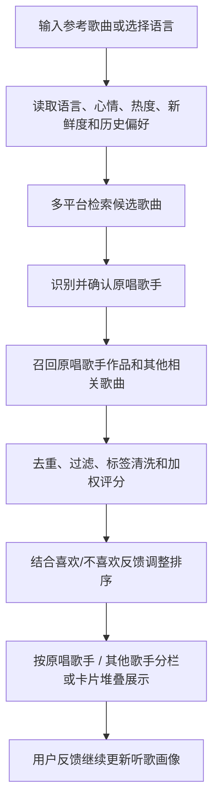

# 多源音乐推荐系统

一个本地运行的多源音乐推荐 Web 应用。用户可以输入一首或多首参考歌曲，系统会从 QQ 音乐、网易云音乐、Apple Music / iTunes、YouTube Music、Spotify 等公开来源检索候选歌曲，并生成最多 10 首带推荐理由的结果。

最新版本在原有“按类型推荐”的基础上加入了个性化听歌画像：用户可以对推荐卡片标记“喜欢 / 不喜欢”，系统会把语言、风格、标签和歌手偏好保存在浏览器本地，并用于后续的“私人电台”推荐。

## 项目地址

- GitHub: <https://github.com/jiangking22/music_recommendation_system>

## 功能特点

- 多平台检索：支持 QQ 音乐、网易云音乐、Apple Music / iTunes、YouTube Music、Spotify 等来源。
- 输入歌曲推荐：输入参考歌曲后，系统会检索相关歌曲、识别原唱歌手，并按语言、类型、热度、标签和歌手相关性排序。
- 语言歌单推荐：不输入歌曲时，可直接选择“不限、华语、英语、日语、韩语、纯音乐”等语言方向生成推荐。
- 原唱歌手确认：当系统发现多个可能歌手时，会弹窗让用户选择或手动填写，减少同名歌曲和翻唱版本造成的误判。
- 结果分栏展示：有明确原唱歌手时，结果会分为“原唱歌手的歌”和“其他歌手的歌”，兼顾相关性与发现感。
- 私人电台：根据历史喜欢/不喜欢反馈、当前语言、心情、新鲜度和热度偏好生成个性化推荐。
- 听歌画像：在本地记录偏好的语言、风格、标签和歌手，可一键重置。
- 心情预设：支持自动、专注学习、通勤路上、夜晚放松、运动高能、发现新歌等模式。
- 推荐卡片交互：推荐结果支持滚轮和方向键切换，卡片展示封面、来源、类型、语言、热度依据、链接和推荐理由。
- 本地缓存：前端会将部分在线检索结果与偏好画像保存在浏览器 `localStorage` 中，提高重复查询体验。

## 技术栈

- 前端：HTML、CSS、JavaScript
- 动画：GSAP CDN
- 后端：Python 3 标准库
- 服务：`http.server` + `ThreadingHTTPServer`
- 数据来源：公开音乐接口、公开网页搜索结果与平台返回的音乐元数据

## 目录结构

```text
music_recommendation_system/
├── index.html          # 页面结构
├── styles.css          # 页面样式、卡片堆叠、听歌画像与响应式布局
├── app.js              # 前端交互、检索调度、推荐排序、偏好学习
├── server.py           # 本地静态服务与音乐平台代理接口
├── requirements.txt    # Python 依赖说明
├── README.md           # 项目说明文档
└── .gitignore          # Git 忽略规则
```

## 环境要求

- Python 3.10 或更高版本
- 现代浏览器：Chrome、Edge、Firefox 均可
- 可访问外部音乐平台或搜索服务的网络环境

项目后端只使用 Python 标准库，不需要安装第三方 Python 包。`requirements.txt` 中也说明了这一点。

前端页面通过 CDN 加载 GSAP：

```html
https://cdnjs.cloudflare.com/ajax/libs/gsap/3.12.5/gsap.min.js
```

GSAP 用于页面和卡片动画，推荐逻辑本身不依赖该动画库。

## 快速开始

克隆项目：

```bash
git clone https://github.com/jiangking22/music_recommendation_system.git
cd music_recommendation_system
```

启动本地服务：

```bash
python server.py
```

macOS 或 Linux 环境也可以使用：

```bash
python3 server.py
```

启动成功后，终端会显示访问地址。默认从 `8010` 端口开始寻找可用端口：

```text
Music Recommendation System: http://127.0.0.1:8010/
Press Ctrl+C to stop.
```

如果 `8010` 被占用，程序会自动尝试 `8011`、`8012` 等相邻端口。

也可以手动指定端口：

```bash
python server.py --port 8020
```

## 使用说明

1. 在“参考歌曲”输入框中输入一首或多首歌曲，例如 `晴天 - 周杰伦`、`七里香`、`Love Story - Taylor Swift`。
2. 多首歌曲可用换行、逗号或分号分隔。
3. 选择推荐语言：不限、华语、英语、日语、韩语或纯音乐。
4. 点击“按类型推荐 10 首”，系统会联网检索并生成推荐。
5. 如果弹出原唱歌手确认框，选择正确歌手，或手动填写歌手名。
6. 在推荐卡片上点击“喜欢”或“不喜欢”，系统会更新本地听歌画像。
7. 在“当前心情”中选择场景，并调整“新鲜度”和“热度”滑杆。
8. 点击顶部“私人电台”，系统会基于偏好画像直接生成个性化推荐。
9. 推荐结果可使用鼠标滚轮或方向键切换卡片。

## 推荐流程



## 评分因素

- 歌曲热度：参考播放量、收藏量、搜索排序、榜单位置、平台热度等信号。
- 语言匹配：判断歌曲是否符合用户选择的推荐语言。
- 类型匹配：根据歌曲画像、平台标签和参考歌曲特征判断风格相似度。
- 标签匹配：关注流行、民谣、电子、情歌、高能、学习、纯音乐等标签。
- 歌手权重：确认原唱歌手后，其作品会获得更高推荐权重。
- 个人偏好：喜欢的语言、类型、标签和歌手会加分，不喜欢的歌曲会在后续推荐中降权。
- 心情偏好：不同场景会偏向不同标签和类型，例如专注、通勤、夜晚、运动或新歌发现。
- 多样性控制：避免结果过度集中在单一平台、单一歌手或单一风格。

## 本地接口

`server.py` 同时提供静态文件服务和本地代理接口：

| 接口 | 说明 |
| --- | --- |
| `/api/search/domestic` | QQ 音乐、网易云音乐搜索 |
| `/api/search/itunes` | Apple Music / iTunes 搜索 |
| `/api/chart/itunes` | Apple Music / iTunes 榜单 |
| `/api/search/artist-songs` | 指定歌手歌曲检索 |
| `/api/search/streaming` | YouTube Music、Spotify 搜索 |
| `/api/search/web-artist` | 网页搜索辅助识别歌手 |

这些接口主要服务于本地演示场景，用于统一前端访问和跨平台检索。

## Spotify 授权配置

Spotify 搜索可以使用官方 Client Credentials 授权。未配置时，系统会尝试使用公开 Web Token 作为降级方案，但稳定性可能受地区和网络环境影响。

PowerShell 示例：

```powershell
$env:SPOTIFY_CLIENT_ID="你的 Spotify Client ID"
$env:SPOTIFY_CLIENT_SECRET="你的 Spotify Client Secret"
python .\server.py
```

凭据通过环境变量读取，项目不会内置真实 API 密钥。`.gitignore` 已忽略 `.env` 和 `.env.*`。

## 数据与隐私

- 项目无需用户登录音乐平台账号。
- 代码中未内置真实 API 密钥。
- Spotify 凭据通过环境变量读取。
- 听歌画像、在线检索缓存和反馈记录保存在浏览器本地 `localStorage`。
- 可通过页面中的重置按钮清空听歌画像。
- 系统基于公开网络信息进行检索和推荐，外部平台接口可用性可能随网络环境变化。

## 设计说明

本项目围绕“多源召回 + 原唱确认 + 可解释推荐 + 个性化反馈”实现完整推荐流程。前端负责用户交互、偏好学习、推荐排序和结果展示；后端负责静态资源托管，以及对多个音乐平台的本地代理检索。

相比只依赖单一平台或固定歌单的推荐方式，本系统强调跨平台数据融合和结果可解释性。最新版本进一步加入私人电台和听歌画像，让推荐可以随着用户反馈逐步贴近个人口味，同时仍保持一定的新歌发现能力。
