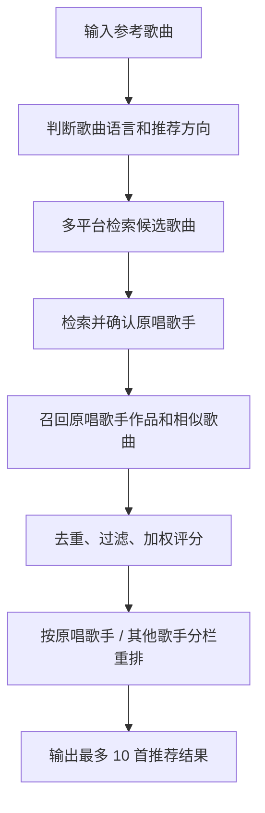

# 多源音乐推荐系统

这是一个本地运行的多源音乐推荐系统。用户输入一首或多首参考歌曲后，系统会联网检索 QQ 音乐、网易云音乐、Apple Music、YouTube Music、Spotify 等平台的公开音乐信息，并生成最多 10 首带有推荐理由的歌曲列表。

项目重点实现“多源召回 + 原唱歌手确认 + 可解释推荐”的完整流程。系统不会在输入时自动发起推荐请求，只有用户点击推荐按钮后才开始检索，便于控制请求节奏，也能减少无效网络访问。

## 项目地址

- GitHub: <https://github.com/jiangking22/music_recommendation_system>

## 功能特点

- 多平台检索：支持 QQ 音乐、网易云音乐、Apple Music、YouTube Music、Spotify 等来源。
- 中英文场景适配：中文歌曲优先检索 QQ 音乐、网易云音乐；英文歌曲优先检索 Apple Music、YouTube Music、Spotify。
- 原唱歌手确认：系统检索候选歌手后弹窗交由用户选择，避免同名歌曲或翻唱版本造成误判。
- 分栏推荐结果：推荐列表区分“原唱歌手作品”和“其他歌手作品”，兼顾相关性和多样性。
- 可解释推荐：每首歌展示语言、类型、来源平台、热度依据、歌手权重和推荐理由。
- 本地代理服务：使用 Python 标准库提供静态页面服务和部分音乐平台接口代理。
- 本地缓存：前端会将部分联网检索结果缓存在浏览器 localStorage 中，提高重复查询时的响应速度。

## 技术栈

- 前端：HTML、CSS、JavaScript
- 动画：GSAP CDN
- 后端：Python 3 标准库
- 服务：`http.server` + `ThreadingHTTPServer`
- 数据来源：公开搜索接口、公开网页搜索结果与平台返回的音乐元数据

## 目录结构

```text
music_recommendation_system/
├── index.html          # 页面结构
├── styles.css          # 页面样式、推荐卡片、弹窗样式
├── app.js              # 前端交互、检索调度、推荐排序、结果渲染
├── server.py           # 本地静态服务与音乐平台代理接口
├── requirements.txt    # Python 依赖说明
├── README.md           # 项目说明文档
└── .gitignore          # Git 忽略规则
```

## 环境依赖

运行环境：

- Python 3.10 或更高版本
- 现代浏览器：Chrome、Edge、Firefox 均可
- 可访问外部音乐平台或搜索服务的网络环境

Python 后端只使用标准库，不需要安装第三方 Python 包。`requirements.txt` 记录了这一依赖状态。

前端页面通过 CDN 加载 GSAP：

```html
https://cdnjs.cloudflare.com/ajax/libs/gsap/3.12.5/gsap.min.js
```

GSAP 用于页面进入动画，推荐功能不依赖该动画库。

## Spotify 授权配置

Spotify 搜索可以使用官方 Client Credentials 授权。如果不配置，系统会尝试使用公开 Web Token 作为降级方案，但稳定性可能受地区和网络影响。

PowerShell 示例：

```powershell
$env:SPOTIFY_CLIENT_ID="你的 Spotify Client ID"
$env:SPOTIFY_CLIENT_SECRET="你的 Spotify Client Secret"
python .\server.py
```

Spotify 凭据通过环境变量读取，`.gitignore` 已忽略 `.env` 和 `.env.*`。

## 运行方式

克隆仓库：

```bash
git clone https://github.com/jiangking22/music_recommendation_system.git
cd music_recommendation_system
```

启动本地服务：

```bash
python server.py
```

macOS 或 Linux 环境：

```bash
python3 server.py
```

启动成功后，终端会显示访问地址，默认从 `8010` 端口开始寻找可用端口：

```text
Music Recommendation System: http://127.0.0.1:8010/
Press Ctrl+C to stop.
```

在浏览器打开：

```text
http://127.0.0.1:8010/
```

`8010` 被占用时，程序会自动尝试 `8011`、`8012` 等相邻端口。

手动指定端口：

```bash
python server.py --port 8020
```

## 使用说明

1. 在左侧输入框输入参考歌曲，例如 `晴天`、`七里香`、`Love Story`。
2. 可以输入多首歌曲，支持换行、逗号或分号分隔。
3. 选择推荐语言，例如“不限”“华语”“英语”“日语”“韩语”“纯音乐”。
4. 点击“按类型推荐 10 首”按钮，系统开始联网检索并生成推荐。
5. 如果系统发现多个可能的原唱歌手，会弹出候选列表，由用户手动确认。
6. 推荐结果会展示歌曲名、歌手、平台、类型、语言、热度依据和推荐理由。

## 推荐流程



## 核心评分因素

- 歌曲热度：优先参考播放量、收藏量、搜索排序、榜单位置等平台信号。
- 语言匹配：判断歌曲是否符合用户选择的推荐语言。
- 类型匹配：根据歌曲画像、平台标签和参考歌曲特征进行匹配。
- 标签匹配：关注流行、民谣、电子、情歌、高能、学习、纯音乐等标签。
- 歌手权重：确认原唱歌手后，其作品会获得更高推荐权重。
- 多样性控制：避免推荐结果过度集中在单一平台、单一歌手或单一风格。

## 本地接口说明

`server.py` 同时提供静态文件服务和本地代理接口：

| 接口 | 说明 |
| --- | --- |
| `/api/search/domestic` | QQ 音乐、网易云音乐搜索 |
| `/api/search/itunes` | Apple Music / iTunes 搜索 |
| `/api/chart/itunes` | Apple Music / iTunes 榜单 |
| `/api/search/artist-songs` | 指定歌手歌曲检索 |
| `/api/search/streaming` | YouTube Music、Spotify 搜索 |
| `/api/search/web-artist` | 网页搜索辅助识别歌手 |

这些接口面向本地运行场景，用于统一前端访问和跨平台检索。

## 设计思路

本项目围绕音乐推荐场景，设计并实现了一个面向多平台音乐数据的本地推荐系统。系统以前端页面作为交互入口，后端 Python 服务负责静态资源托管和音乐平台代理检索。用户输入参考歌曲后，系统根据歌曲语言和用户选择的推荐方向，从多个音乐平台召回候选歌曲，并结合热度、语言、类型、标签、歌手相关性等因素进行加权排序。

相比只依赖单一平台或固定歌单的推荐方式，本系统强调多源数据融合和推荐结果可解释性。对于同名歌曲、翻唱歌曲较多的情况，系统引入原唱歌手确认环节，将关键判断交给用户完成，降低推荐误差。最终结果按“原唱歌手作品”和“其他歌手作品”分栏展示，使推荐列表既保留用户输入歌曲的相关性，又提供一定的新歌发现能力。

## 安全与隐私说明

- 项目无需用户登录音乐平台账号。
- 代码中未内置真实 API 密钥。
- Spotify 凭据通过环境变量读取。
- `.env`、`.env.*`、缓存、日志、虚拟环境等本地文件已加入 `.gitignore`。
- 系统基于公开网络信息进行检索和推荐。
