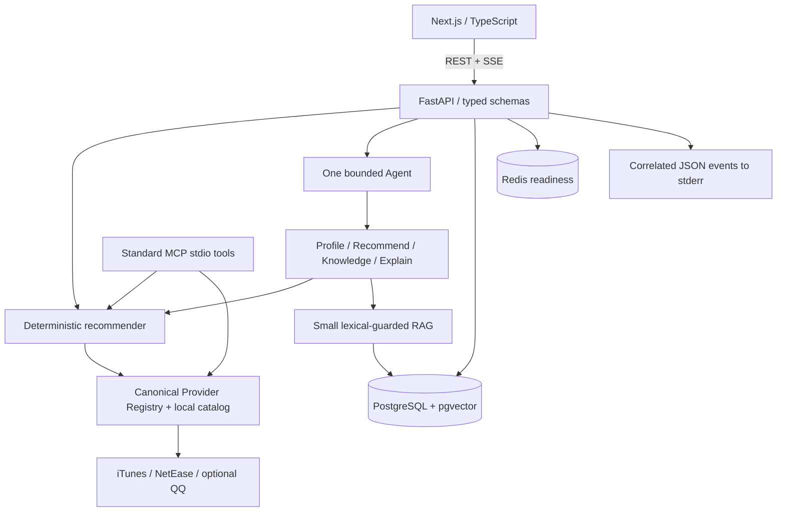

# Sonora · Explainable Music Recommendation / 可解释音乐推荐

[](https://github.com/jiangking22/music_recommendation_system/actions/workflows/ci.yml)

A portfolio project combining a deterministic multi-source recommender with one bounded music
Agent. It demonstrates typed service boundaries, durable anonymous feedback, offline evaluation,
small RAG, standard MCP tools, and reproducible quality gates. The recommender owns every score
and ordering decision; the Agent selects tools and explains their results.

求职作品：以确定性多源推荐为核心，结合一个受控音乐 Agent，展示类型化接口、持久化匿名反馈、
离线评估、小型 RAG、标准 MCP 工具和工程质量门禁。所有推荐分数与顺序由推荐器决定，Agent 负责工具选择和解释。
这是可运行的工程演示，不是商业音乐服务或经过真实用户验证的推荐产品。

## Preview / 展示

The Next.js homepage offers seed input, recommendation cards, explanations, provenance,
like/dislike and preferences. `/agent` presents chat, tool status and knowledge citations.

新版首页提供参考输入、推荐卡片、理由、来源、喜欢/不喜欢与画像；`/agent` 提供对话、工具状态和知识引用。
Actual browser captures use the offline fixture catalog and local rule-based assistant, with a
temporary SQLite test database. They do not verify Docker/PostgreSQL or live providers/LLMs.
截图来自真实运行页面：离线固定曲库、本地规则助手、临时 SQLite 测试库；不代表容器、PostgreSQL 或真实来源/模型验证。
Capture details / 拍摄说明：[screenshots/README](docs/screenshots/README.md)。

**Recommendations / 推荐与解释**


**Preferences / 点赞后的偏好与推荐**


**Local assistant / 本地助手、工具状态与引用**


Follow the five-minute [demo flow / 演示流程](docs/DEMO.md) for a reproducible walkthrough.

## Architecture / 架构


```mermaid
flowchart TB
  Web[Next.js / TypeScript] -->|REST + SSE| API[FastAPI / typed schemas]
  API --> Rec[Deterministic recommender]
  API --> Agent[One bounded Agent]
  Agent --> Tools[Profile / Recommend / Knowledge / Explain]
  Tools --> Rec
  Tools --> RAG[Small lexical-guarded RAG]
  Rec --> Registry[Canonical Provider Registry + local catalog]
  Registry --> Sources[iTunes / NetEase / optional QQ]
  API --> PG[(PostgreSQL + pgvector)]
  RAG --> PG
  API --> Redis[(Redis readiness)]
  MCP[Standard MCP stdio tools] --> Rec
  MCP --> Registry
  API --> Logs[Correlated JSON events to stderr]
```

Web consumes canonical API models; provider payloads stay inside adapters. PostgreSQL owns
feedback, profiles, vectors, conversations and knowledge. Redis currently participates in
readiness only; caching/rate limiting is future work. [Architecture](ARCHITECTURE.md) / [ADRs](DECISIONS.md).

网页只消费统一模型，来源协议封装在适配器内部。PostgreSQL 持久化反馈、画像、向量、会话和知识。
Redis 当前只参与就绪检查，尚未实现缓存或限流。

## Feature overview / 功能与技术栈

| Area / 模块 | Implemented / 已实现 |
| --- | --- |
| Web | Next.js 16, React 19, TypeScript; accessible request/empty/error states, responsive cards / 响应式产品页面 |
| API | Python 3.12, FastAPI, Pydantic, SQLAlchemy 2, Alembic; versioned contracts and error envelopes / 版本化类型接口 |
| Catalog | iTunes + NetEase defaults, QQ opt-in; timeouts, caps, partial failures, local fallback / 多源降级 |
| Recommendation | Canonical deduplication, explicit scoring, diversity rerank, factor explanations / 确定性排序与解释 |
| Personalization | Latest rating wins, durable bounded affinity snapshot, disliked-track penalties / 持久化偏好 |
| Embeddings | Local 16D SHA-256 feature hashes, pgvector storage/cosine retrieval / 无模型下载的演示向量 |
| Agent / RAG | Local router or optional OpenAI-compatible adapter; four tools, six-turn memory, four-document knowledge fixture / 受控助手 |
| MCP | Official Python SDK stdio server with two read-only tools; legacy HTTP façade retained / 标准 stdio + 兼容保留接口 |
| Quality | pytest, Ruff, compile check, Vitest, ESLint, tsc, Next build, GitHub Actions, Compose / 自动质量门禁 |
| Observability | request/trace IDs, route, duration/status, provider/recommendation/tool/model/token/error events / 轻量结构化日志 |

NetEase and QQ use undocumented public endpoints and carry `unverified` metadata. iTunes uses
Apple's documented search API. No live provider availability is guaranteed. / 网易云、QQ 接口无稳定承诺；
测试使用固定 payload，不代表真实服务永远可用。

## Recommendation pipeline / 推荐流程

1. Recall up to 25 candidates per provider and include the committed local catalog. / 有界多源召回，加本地曲库降级。
2. Normalize and merge canonical title/artist variants, retaining provenance. / 归一化去重，保留来源。
3. Score seed similarity, attributes and optional preference signals using [explicit policy](services/api/app/domain/policy.py). / 显式权重打分。
4. Apply deterministic diversity penalties and generate measured factor explanations. / 多样性重排与因素解释。
5. Save feedback and recompute the latest 200-rating profile; the next request uses it. / 反馈更新画像，影响下次结果。

Embeddings and RAG do not silently enter ranking. No LLM ranks songs. / 向量与 RAG 不隐式参与排序，LLM 不排序。

## Agent, memory, RAG and MCP / 助手与工具协议

The Agent validates one plan of 1–4 distinct allowlisted tools. A 30-second default deadline,
four active requests and four worker slots bound work. Tools cannot save feedback, execute shell,
fetch arbitrary URLs or modify rank policy. JSON and SSE expose public status and canonical
results. PostgreSQL retains six turns and a derived preference summary per conversation.

Agent 验证一次计划，只能执行 1–4 个不同的白名单工具；默认 30 秒期限、四个并发请求和四个工作槽。
工具不写反馈、不执行命令、不抓取任意 URL、不修改排序。会话保存最近六轮与来自反馈的偏好摘要。
缺少 Key 时使用确定性本地路由，它不是语言模型；真实模型兼容性与效果尚未实测。

RAG uses four versioned bilingual documents, local hash vectors, pgvector candidates and a lexical
guard. It grounds answers and never supplies new ranking policy. / RAG 使用四篇固定资料与词汇重合校验，仅辅助解释。

The separate **standard MCP stdio server** supports initialize, tools/list and tools/call through
[the official SDK v1 API](https://py.sdk.modelcontextprotocol.io/v1/). A real SDK client subprocess test
calls `music_search` and `recommend_tracks`. Install the optional dependency and run from `services/api`:

```bash
python -m pip install -e '.[dev,mcp]'
python -m app.mcp.server --offline
```

Configure a compatible client with an absolute Python executable, `args: ["-m", "app.mcp.server",
"--offline"]`, and `cwd` set to the absolute `services/api` directory. No database or Key is needed
in offline stdio mode. Remove `--offline` and supply server configuration to enable provider search.
Logs go to stderr; stdout is exclusively MCP JSON-RPC. Recommendations here are read-only and
unpersonalized, with the same scoring service. No remote MCP HTTP transport or OAuth is shipped.

兼容客户端启动上述命令即可调用两个只读工具；离线模式不需要数据库或 Key。标准服务仅提供 stdio，
不提供远程 MCP HTTP/OAuth。`GET /v1/mcp/tools` 与 `POST /v1/mcp/tools/call` 仍是 **MCP-style HTTP façade**，
不可当作标准 MCP HTTP endpoint。

## Quick Start / 快速开始

Requirements / 环境：Git, Python 3.12, Node.js 24/npm 11. Full target runtime needs PostgreSQL 16
with pgvector and Redis 7; Docker Compose is the recommended local setup.

```bash
git clone https://github.com/jiangking22/music_recommendation_system.git
cd music_recommendation_system
```

For a zero-dependency legacy preview / 零第三方依赖旧版预览：

```bash
python server.py
```

Open the printed loopback URL (preferred port 8010). This is the legacy browser-ranking demo.
For the target product use Docker below. / 按终端地址打开旧版；新版产品按下方 Compose 启动。

## Docker Start / 完整新版启动

```bash
cp .env.example .env
# PowerShell: Copy-Item .env.example .env
# Edit POSTGRES_PASSWORD and the matching password in DATABASE_URL.
# 设置数据库密码并同步 DATABASE_URL；展示用可设置 ENABLE_MUSIC_PROVIDERS=false。
docker compose config --quiet
docker compose up --build --wait --wait-timeout 180
```

Open [web](http://localhost:3000), [assistant](http://localhost:3000/agent),
[API docs](http://localhost:8000/docs), and [readiness](http://localhost:8000/health/ready).
API startup applies Alembic migrations before serving. Only loopback web/API ports are exposed;
data-service ports stay internal. No LLM Key is required.

API 启动前运行迁移；仅网页和 API 的回环端口对外可见。无需真实音乐源或 LLM Key 即可演示固定曲库与本地助手。
**Author's Windows host has no Docker: container clean-start was not executed locally / 本机未实机执行。**
CI includes a disposable clean-start job; inspect its actual run before claiming container success.
See [deployment/runbook](docs/DEPLOYMENT.md) for manual services, verification and cleanup.

## Tests and release gates / 测试

Run API checks without database services, music providers, or LLM credentials:

```bash
cd services/api
python -m venv .venv
# Bash: source .venv/bin/activate
# PowerShell: .\.venv\Scripts\Activate.ps1
python -m pip install -e '.[dev,mcp]'
python -m pytest -q
python -m ruff check app tests scripts
python -m compileall -q app migrations scripts
python -m app.domain.evaluation
```

Then, from the repository root / 返回项目根目录：

```bash
cd apps/web
npm ci
npm test
npm run lint
npm run typecheck
npm run build
npm audit --audit-level=high
cd ../..
python scripts/legacy_smoke.py
```

Local Phase 6 verification: **72 API tests, 12 web tests**, all listed lint/type/build checks,
editable install/wheel fixture checks, full offline PostgreSQL upgrade/downgrade SQL, legacy HTTP
smoke and evaluation passed. Tests forbid real HTTP at provider/model boundaries. CI has API,
web and clean-start jobs with bounded timeouts and read-only repository permissions.

本机通过上述测试与检查；PostgreSQL 的完整升降级 SQL 静态验证通过。测试禁止真实业务 HTTP；
离线检查不能替代实机容器、PostgreSQL 或真实模型验证。[Observability/runbook](docs/OBSERVABILITY.md)。

## Offline evaluation / 离线评估

`python -m app.domain.evaluation` runs the committed five-song/two-case `evaluation_v1` fixture.

| Metric / 指标 | Result / 结果 |
| --- | ---: |
| Mean precision@2 / 相关性 | 1.0 |
| Mean preferred-song rank lift / 个性化名次提升 | 1.0 |
| Attribute diversity / 属性多样性 | 0.8333 |
| Catalog coverage / 曲库覆盖率 | 0.8 |

These are regression signals, **not real-user benchmarks**. No throughput/accuracy claims are
made for live music or LLMs. Definitions and reproducible command: [evaluation report](docs/phase3-evaluation.md).

## API overview / 接口概览

| Method + route | Purpose / 用途 |
| --- | --- |
| `GET /health`, `/health/ready` | Liveness; DB + Redis readiness / 存活与依赖就绪 |
| `GET /v1/device` | Resolve anonymous device / 设备关联 |
| `GET /v1/providers`, `/v1/providers/health` | Capabilities; last-operation state / 来源能力与最近状态 |
| `GET /v1/tracks/search?q=jazz&limit=5` | Canonical search / 统一检索 |
| `POST /v1/recommendations` | `{seed, limit}` → items, request_id, sources / 推荐 |
| `POST /v1/feedback` | `{track, value: like or dislike}` / 保存反馈 |
| `GET /v1/profile` | Top affinities and five recent ratings / 画像 |
| `POST /v1/agent/chat`, `/v1/agent/chat/stream` | `{message, device_id, conversation_id?}` / JSON 或 SSE 对话 |
| `GET /v1/mcp/tools`, `POST /v1/mcp/tools/call` | Legacy MCP-style HTTP search façade / 保留接口 |

Personalized REST requests use bounded `X-Device-Id`; chat uses a body device ID. IDs link data,
not authentication or privilege. HTTP errors use `{"error":{"code":"...","message":"..."}}`;
SSE reports errors as terminal events after HTTP 200. Requests return `X-Request-Id`/`X-Trace-Id`.

匿名 ID 不提供安全身份隔离。请求体上限 64 KiB，输入与结果数量有界，默认 CORS 仅允许本地网页来源。

## Project structure / 目录

```text
apps/web/                   Next.js product, /agent, client tests
services/api/app/
  api/                      typed REST/SSE routes
  domain/                   scoring, profiles, embeddings, evaluator/fixtures
  providers/                canonical adapters and registry
  services/                 recommendation/device use cases
  repository/               durable persistence and pgvector queries
  agent/                    bounded orchestration, tools, memory, LLM adapters
  rag/                      fixture ingestion and retrieval
  mcp/                      standard stdio server + HTTP façade business tools
  observability/            content-free JSON events and correlation
services/api/migrations/    five Alembic revisions
services/api/tests/         offline unit/integration and real MCP transport test
services/api/scripts/       container and wheel acceptance scripts
infra/postgres/             extension initialization
docs/                       deployment, demo, logs, evaluation, specs
.github/workflows/          API/web/clean-start quality gates
index.html / app.js / styles.css / server.py    preserved legacy demo
```

## Design decisions / 设计取舍

[ADRs](DECISIONS.md) explain incremental migration, anonymous linkage, deterministic ranking,
small local embeddings, one validated Agent plan, bounded memory, stdio MCP and JSON telemetry.
Avoiding a distributed monitoring stack and remote MCP auth keeps this final engineering phase
focused on maintainability and reproducible evidence.

取舍：业务层拥有确定性策略，Provider 与 LLM 可替换；小样本演示降低外部依赖，明确其泛化限制。
完整决策见 ADR；[plan](PROJECT_PLAN.md) 与 [TODO](TODO.md) 区分实现和验证状态。

## Known Limitations / 已知限制

- Docker/PostgreSQL/pgvector not executed on the author's local host; offline SQL and SQLite tests
  are different evidence. / 本机无 Docker，实机状态以 CI 或部署机器结果为准。
- Real-model quality and compatibility are unverified; local routing has limited bilingual patterns.
  / 真实 LLM 未实测；本地助手只能识别有限规则。
- Tiny catalog, two-case evaluation and 16D hash collisions limit relevance and RAG semantics.
  / 小曲库、小评估和哈希冲突不支持线上质量推断。
- Anonymous identifiers are not authentication. Chat is stored in bounded rows, but there is no
  retention sweep, history/deletion UI, cross-device recovery or distributed rate limiter.
  / 不适合存放敏感个人信息；公开部署需要认证、保留策略和入口限流。
- External music interfaces may fail or change. There is no licensed playback or full streaming.
  / 来源可能变化，不提供授权音乐播放服务。
- A timed-out synchronous job can finish and commit; four worker slots bound it rather than kill it.
  / 超时不能强制终止已运行的同步任务。
- MCP is local stdio only; HTTP routes are a façade. No remote OAuth/Streamable HTTP is implemented.
  / 不宣称完整远程 MCP 服务。
- Direct API dependencies and build backend are pinned; transitive Python packages and container
  image tags are not digest-locked. / 尚非完全 hermetic 构建。

## Roadmap / 后续方向

Engineering phases 0–6 are delivered. Future work is deliberately unimplemented: verified larger
catalog and real-user evaluation, authenticated deployment and retention controls, useful Redis
caching/rate limits, optional remote MCP authorization, and broader live-provider/model testing.

工程阶段 0–6 已交付；后续方向不自动启动：更可靠曲库与真实用户评估、认证与保留策略、Redis 缓存/限流、
远程 MCP 授权及真实来源/模型测试。No Kubernetes, microservice split or multiple Agents is planned.

## Legacy versus target / 旧版与新版

| Runtime | Role / 定位 | Start / 启动 |
| --- | --- | --- |
| Legacy | Browser orchestration/ranking + stdlib proxy; localStorage preferences; more best-effort sources / 原始课程演示 | `python server.py` |
| Target | Next.js + typed FastAPI + durable profiles + bounded Agent + MCP; separate business layers / 求职展示工程 | `docker compose up --build --wait` |

Legacy sources include QQ, NetEase, iTunes, YouTube and Spotify fallbacks; they are not guarantees
of target-runtime support. The four legacy files remain unchanged and runnable.
旧版来源更多，但不代表新版全部支持；四个旧版文件保持原状。
