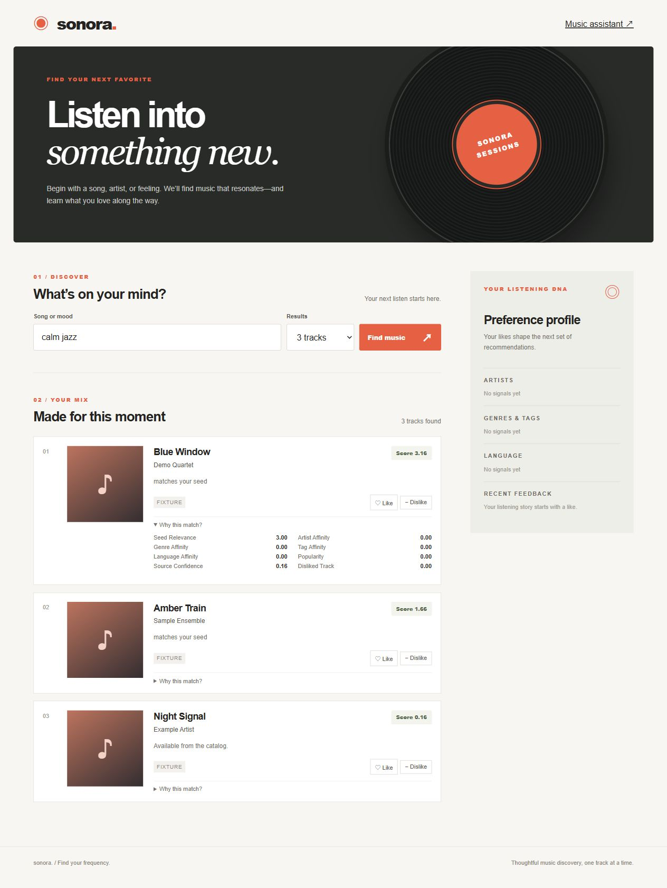
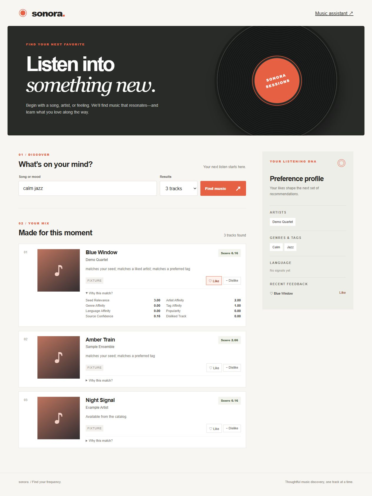
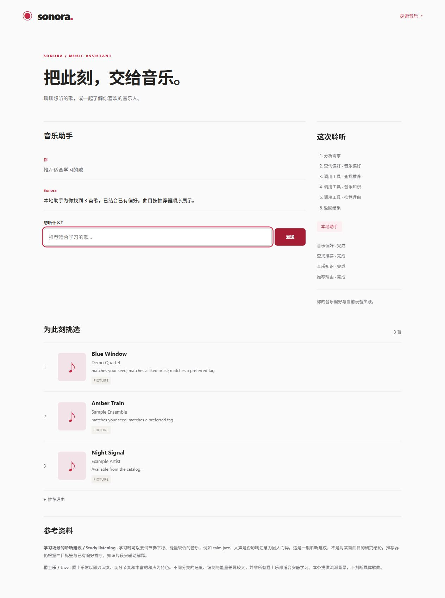
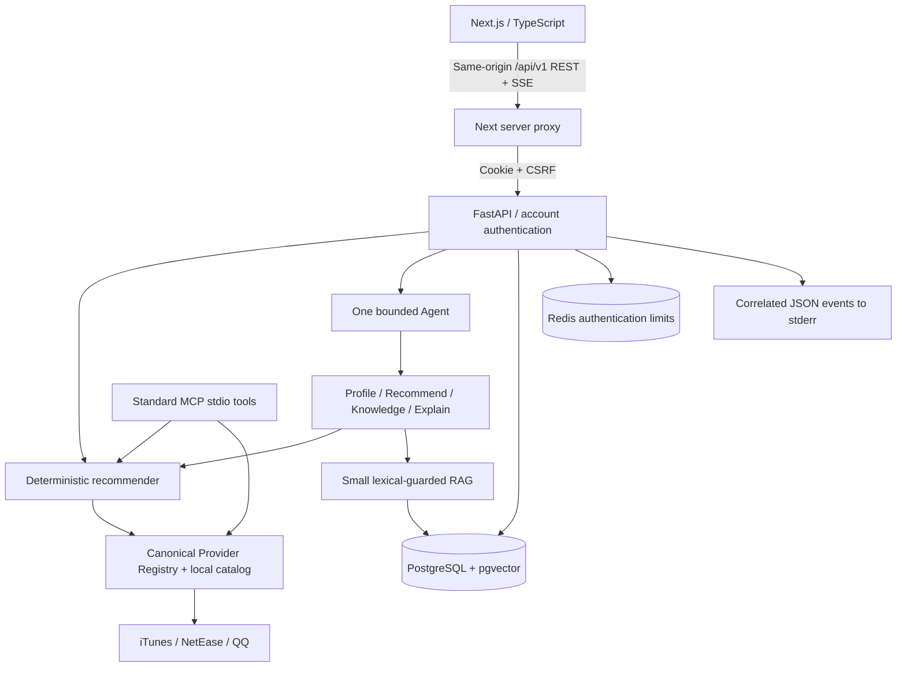

# Sonora · Explainable Music Recommendation / 可解释音乐推荐

[](https://github.com/jiangking22/sonora/actions/workflows/ci.yml)

Sonora is a music recommendation project combining a deterministic multi-source recommender with one bounded music
Agent. It demonstrates typed service boundaries, account-scoped portable preferences, offline evaluation,
small RAG, standard MCP tools, and reproducible quality gates. The recommender owns every score
and ordering decision; the Agent selects tools and explains their results.

Sonora 音乐推荐项目：以确定性多源推荐为核心，结合一个受控音乐 Agent，展示类型化接口、账号持久化与跨设备偏好、
离线评估、小型 RAG、标准 MCP 工具和工程质量门禁。所有推荐分数与顺序由推荐器决定，Agent 负责工具选择和解释。
这是可运行的工程演示，不是商业音乐服务或经过真实用户验证的推荐产品。

## Recent updates / 近期更新

As of 2026-10-07, Sonora includes mandatory account login and portable preferences,
catalog-verified song identification with artist confirmation, optional deep music conversation,
a fixed-height chat panel, and progressive recommendation search with labelled evidence.
The repository is `jiangking22/sonora`; existing local checkout folders can keep their names.
Runtime package identifiers and database names are retained for compatibility.

截至 2026-10-07，Sonora 已实现账号登录与跨设备偏好、曲库核实与歌手确认、可选深度对话、
固定高度聊天区，以及带依据标注的渐进式推荐检索。仓库名称为 `jiangking22/sonora`；
已有本地目录可保留原名，运行包名与数据库名称保持兼容。
真实密钥仅放在环境变量或忽略的本地 `.env` 中；提交的 `.env.example` 仅含占位配置。

## Version and license / 版本与许可证

Listening constraints distinguish unknown metadata from mismatches. Optional structured model
assistance supplements catalog-confirmed tracks and appears as separate `attribute_evidence`;
source conflicts override inference. Candidate pools reuse up to 150 records for 30 minutes and
exclude previously shown songs for follow-ups. Insufficient pools expand across existing catalogs
and optional Brave clues, which must be verified against catalog identities. Requests share a
24-operation/45-second discovery budget. Brave needs BRAVE_SEARCH_API_KEY; native model search
is a separate unavailable capability. The assistant displays actual stages, returned/requested
counts, expansion status, inference labels and catalog-verified web references.

聆听条件已区分未知属性与不匹配；模型辅助判断单独标注，不覆盖来源冲突。
候选池可复用 30 分钟，“再来几首”排除已展示歌曲；不足时自动多轮曲库扩搜，网页线索须回曲库核实。
检索最多 24 次外部调用、45 秒；Brave 须配置环境密钥，当前主机未配置，页面显示“网页搜索未配置”。
助手显示实际检索阶段、返回数量、是否扩搜、模型推断标识和核实过的网页来源。
See [local acceptance / 本地验收记录](docs/progressive-discovery-acceptance.md).

Sonora **v1.0.0** uses the [MIT License](LICENSE), copyright 2026 jiangking22.
API, web and OpenAPI application metadata are version **1.0.0**.
See [CHANGELOG](CHANGELOG.md), [release notes](docs/releases/v1.0.0.md) and
[release audit](docs/releases/v1.0.0-readiness.md).

Sonora 正式版本为 v1.0.0，采用 MIT License；API、Web 与 OpenAPI 应用版本统一为 1.0.0。

## Preview / 展示

The Next.js homepage offers seed input, recommendation cards, explanations, provenance,
like/dislike and preferences. `/agent` presents chat, tool status and knowledge citations.

新版首页提供参考输入、推荐卡片、理由、来源、喜欢/不喜欢与画像；`/agent` 提供对话、工具状态和知识引用。
The assistant has a manual deep-thinking checkbox (off by default, kept for this page visit).
Official DeepSeek chat uses an opt-in 120-second budget; Stop cancels the pending reply.
Unsupported model endpoints and local fallback report their actual mode. Homepage identification
keeps its existing non-thinking budget. Raw model reasoning is not returned, stored or logged.

助手提供默认关闭的“深度思考”开关，本页面内保留选择；官方 DeepSeek 对话开启后最多等待约两分钟，
可点击“停止”取消。接口不支持或模型故障时明确显示实际模式；首页识曲保持原预算。
仅展示回答、依据和工具进度，模型原始思考不返回、不入库、不写日志。

Follow-ups combine the latest correction with six recent turns. Discussion and explanations
of earlier recommendations can answer without a fresh playlist. Language/vocal refinements use
catalog evidence or separately labelled structured inference; insufficient candidates trigger new
catalog searches. Unresolved attributes remain unknown and do not count toward the requested total.
General music concepts and qualitative interpretations of familiar recordings may use model music
knowledge. Such interpretations are not listening measurements or verified catalog facts and do
not affect ranking. Exact BPM, verified instrumentation/version details and current events require
evidence; an unfamiliar recording prompts an artist/version clarification.

连续追问结合最近六轮与最新补充；聊风格、心情或解释上一轮推荐时可直接回答。华语、人声等条件
按来源依据或单独标注的结构化模型推断筛选，候选不足时实际扩搜；仍未知的属性不计入合格数量。
一般曲风及熟悉歌曲的定性听感可以基于模型音乐
知识交流，不机械提示缺少 BPM；这类解读不改变排序，也不代表实听、实测或联网核验。精确 BPM、
可核对的乐器配置、版本及最新事实仍需证据；陌生作品会询问歌手或版本。

The conversation panel has a viewport-based fixed height; messages and notices scroll inside it.
The composer, thinking switch and Stop stay at the bottom. Sending follows the latest message;
new replies preserve your position when reading earlier messages, with a “回到最新” button.
Page-local visible history can exceed six turns; model context remains the last six turns per
login session. A shrinking mobile visual viewport reduces the panel while the input is focused.
Recommendation cards and references remain outside the panel.

聊天面板高度随屏幕调整，不随消息变长；消息和提示在内部滚动，输入、深度开关与停止按钮固定在底部。
发送后滚到最新，向上阅读时保持位置并显示“回到最新”。当前页面可查看超过六轮的消息，但模型仍只接收
当前登录会话最近六轮上下文；手机输入时可用视口缩小会收缩面板。推荐卡片和参考资料保留在面板外。

Native web search is **currently unavailable**. The configured DeepSeek service was probed on
2026-10-07 without verified search records or source citations; the page reports this before chat.
Thinking does not imply web access. Optional Brave search uses the existing BRAVE_SEARCH_API_KEY;
music catalogs search independently without it. Model-generated
links are not treated as search evidence. To repeat the bounded manual check from the repository root:

模型原生联网检索**暂不可用**：2026-10-07 使用已配置的同一 DeepSeek 服务实测，未取得可验证的搜索记录与来源引用。
页面分别报告音乐平台检索、Brave 网页搜索和模型原生搜索；音乐平台扩搜不需要 Brave 密钥。
深度思考可正常使用，模型生成的链接不算检索证据。
手动复查命令（不会修改配置或自动启用联网）：

```powershell
$env:PYTHONPATH = "services/api"
services/api/.venv/Scripts/python.exe services/api/scripts/model_capability_probe.py
```

Historical captures below predate account login and use the offline fixture catalog and local rule-based assistant, with a
temporary SQLite test database. They do not verify Docker/PostgreSQL or live providers/LLMs.
截图来自真实运行页面：离线固定曲库、本地规则助手、临时 SQLite 测试库；不代表容器、PostgreSQL 或真实来源/模型验证。
Capture details / 拍摄说明：[screenshots/README](docs/screenshots/README.md)。

**Recommendations / 推荐与解释**



**Preferences / 点赞后的偏好与推荐**



**Local assistant / 本地助手、工具状态与引用**



Follow the five-minute [demo flow / 演示流程](docs/DEMO.md) for a reproducible walkthrough.

## Architecture / 架构


```mermaid
flowchart TB
  Web[Next.js / TypeScript] -->|Same-origin /api/v1 REST + SSE| Proxy[Next server proxy]
  Proxy -->|Cookie + CSRF| API[FastAPI / account authentication]
  API --> Rec[Deterministic recommender]
  API --> Agent[One bounded Agent]
  Agent --> Tools[Profile / Recommend / Knowledge / Explain]
  Tools --> Rec
  Tools --> RAG[Small lexical-guarded RAG]
  Rec --> Registry[Canonical Provider Registry + local catalog]
  Registry --> Sources[iTunes / NetEase / QQ]
  API --> PG[(PostgreSQL + pgvector)]
  RAG --> PG
  API --> Redis[(Redis authentication limits)]
  MCP[Standard MCP stdio tools] --> Rec
  MCP --> Registry
  API --> Logs[Correlated JSON events to stderr]
```

Web consumes canonical API models; provider payloads stay inside adapters. PostgreSQL owns
feedback, profiles, vectors, conversations and knowledge. Redis provides authentication rate limits and readiness; caching remains future work. [Architecture](ARCHITECTURE.md) / [ADRs](DECISIONS.md).

网页只消费统一模型，来源协议封装在适配器内部。PostgreSQL 持久化反馈、画像、向量、会话和知识。
Redis 提供认证限流与就绪检查，业务缓存尚未实现。

## Accounts and portable preferences / 登录与跨设备偏好

The target application requires an account. Open `/register`, choose a unique username
(6–20 ASCII letters, digits or underscores, case-insensitive) and a 6–20 character password.
Registration signs you in; `/login` supports 24-hour sessions or 30 days with “Remember me”.
Use the username menu to change your password or sign out. Forgotten passwords require a local
administrator reset; there is no email/SMS/OAuth or public administration page.

新版必须登录。账号与密码均为 6–20 个字符（含 6 和 20）。用户名使用字母、数字或下划线，
不能重复且不区分大小写；密码可含空格。
注册后自动登录，默认 24 小时，保持登录 30 天。顶部账号菜单可改密或退出；忘记密码需联系管理员。
同账号在不同设备读取相同喜欢、不喜欢、画像和向量；新账号不认领旧匿名数据。
助手仅保留当前登录会话的六轮上下文，不同步助手历史或界面语言。

FastAPI enforces authentication on every HTTP business endpoint, including search and SSE.
Passwords use Argon2id; opaque sessions live in HttpOnly cookies with revocation and expiry.
Writes require an allowed Origin and CSRF token. Redis limits registration and login and fails
closed when unavailable. Browsers use only same-origin `/api/v1/*`; `API_INTERNAL_URL` is server-only.
Production requires HTTPS, secure cookies and disables public API documentation.
See [deployment and reset instructions](docs/DEPLOYMENT.md), [spec](docs/specs/account-login.md)
and [ADR-029](DECISIONS.md).

后端统一鉴权，直接调用 API 也须登录；Cookie、CSRF、Origin 与 Redis 限流均在后端执行。
账号切换、退出或检测到过期时清空私有页面并取消旧请求；恢复焦点及业务操作会刷新账号偏好。
本地 HTTP 使用明确开发配置，生产须启用 HTTPS 与 Secure Cookie。

## Feature overview / 功能与技术栈

| Area / 模块 | Implemented / 已实现 |
| --- | --- |
| Web | Next.js 16, React 19, TypeScript; accessible request/empty/error states, responsive cards / 响应式产品页面 |
| API | Python 3.12, FastAPI, Pydantic, SQLAlchemy 2, Alembic; versioned contracts and error envelopes / 版本化类型接口 |
| Catalog | iTunes + NetEase + QQ defaults; timeouts, caps, partial failures, local fallback / 多源降级 |
| Recommendation | Canonical deduplication, explicit scoring, diversity rerank, factor explanations / 确定性排序与解释 |
| Accounts | Username/password registration, login, logout, password change, local reset / 强制登录 |
| Personalization | Same account across devices, latest rating wins, durable bounded affinity snapshot, disliked-track penalties / 持久化偏好 |
| Embeddings | Local 16D SHA-256 feature hashes, pgvector storage/cosine retrieval / 无模型下载的演示向量 |
| Agent / RAG | Local router or optional OpenAI-compatible adapter; four tools, six-turn memory, four-document knowledge fixture / 受控助手 |
| MCP | Official Python SDK stdio server with two read-only tools; legacy HTTP façade retained / 标准 stdio + 兼容保留接口 |
| Quality | pytest, Ruff, compile check, Vitest, ESLint, tsc, Next build, GitHub Actions, Compose / 自动质量门禁 |
| Observability | request/trace IDs, route, duration/status, provider/recommendation/tool/model/token/error events / 轻量结构化日志 |

NetEase and QQ use undocumented public endpoints and carry `unverified` metadata. iTunes uses
Apple's documented search API. No live provider availability is guaranteed. / 网易云、QQ 接口无稳定承诺；
测试使用固定 payload，不代表真实服务永远可用。

The default registry now queries iTunes, NetEase and QQ sequentially, so a missing Apple recording
can still be resolved and recommended from a real domestic catalog. QQ is used by initial model
identification, candidate-rejection verification, confirmation and feedback refresh alike; matched
model suggestions show the canonical source link. Set `ENABLE_QQ_PROVIDER=false` to opt out, or
`ENABLE_MUSIC_PROVIDERS=false` for offline mode. Existing `.env` files with QQ disabled need
`ENABLE_QQ_PROVIDER=true` and API recreation. No new credential is required.

默认来源现为 iTunes、网易云、QQ，依次有界查询。Apple 缺少录音时，可使用国内曲库的真实歌曲核实并推荐；
首次模型识别、“以上均没有”、确认及刷新使用同一来源集合，匹配的模型建议展示实际歌曲来源链接。
旧 `.env` 若设置了 `ENABLE_QQ_PROVIDER=false`，需改为 `true` 并重建 API；设为 `false` 仍可关闭 QQ，
`ENABLE_MUSIC_PROVIDERS=false` 保持完全离线。首页还会自动扩展地区与 MusicBrainz；详细预算、可选
Brave Key 和人工来源恢复见下文。原同步推荐／Agent／MCP 保留已有查询契约。

## Recommendation pipeline / 推荐流程

The assistant recognizes short listening themes such as `emo的歌` and `缓慢的歌`; use a quoted
title such as `推荐《emo》` for a particular song. During model connection/HTTP failures it
continues in visibly labelled basic mode using the deterministic recommender and local answer
templates. Already computed tracks retain their ordering. Complex questions without local
knowledge ask you to retry later; invalid model outputs and whole-turn timeouts still report errors.
Theme matching uses catalog metadata, not measured tempo/emotion. Failed-message retries reuse
one pending UI entry. TLS verification remains enabled with the system certificate store.

助手支持“emo的歌”“缓慢的歌”等简短主题需求；具体歌名可输入“推荐《emo》”。模型连接或 HTTP
失败时会明确标注“基础模式”，继续用确定性推荐器和本地回答模板；已有曲目保持原排序。
复杂问答缺少本地资料时提示稍后重试，非法模型输出和整轮超时仍显示错误。主题匹配基于曲库元数据，
不代表测量了 BPM 或情绪。失败重试只保留一条待完成消息；模型 TLS 使用系统信任库并保持校验开启。

1. Recall up to 25 candidates per provider and include the committed local catalog. / 有界多源召回，加本地曲库降级。
2. Normalize and merge canonical title/artist variants, retaining provenance. / 归一化去重，保留来源。
3. Score seed similarity, attributes and optional preference signals using [explicit policy](services/api/app/domain/policy.py). / 显式权重打分。
4. Apply deterministic diversity penalties and generate measured factor explanations. / 多样性重排与因素解释。
5. Save feedback and recompute the latest 200-rating profile; the next request uses it. / 反馈更新画像，影响下次结果。

Embeddings and RAG do not silently enter ranking. No LLM ranks songs. / 向量与 RAG 不隐式参与排序，LLM 不排序。

### Homepage discovery / 首页歌曲推荐

The homepage identifies a recording before recalling related songs from its artist and available
genre/tag context. Source-backed hints identify `我好想你` with 苏打绿 and `匆匆那年` with 王菲;
your explicit artist selection takes precedence. Other song inputs, including a single unverified
version, use optional model identification or ask for artist confirmation. The model returns only
strict `kind`/`title`/`artist` fields; a song suggestion must match a real canonical catalog recording.
Every model-derived artist, including the initial match, waits for **Confirm and recommend**;
discovery returns `requires_confirmation=true` and no recommendations before that action.
Choose **Different artist — I'll provide it** if the suggestion is wrong, enter the artist and
verify across available platforms (or specify a platform/song link), then select the real recording.
Only the explicitly confirmed and revalidated recording is remembered. The UI labels catalog
presence as recording evidence, not certified original authorship. The
deterministic recommender still owns related-song recall and ranking, excludes seed versions and
alternate recordings, and never fills a song request with unrelated demo tracks. Explicit
mood/genre inputs retain catalog fallback even when model identification is unavailable. A model's `theme` classification permits that
fallback only when no recording title matched; an unknown song does not silently become a theme.

首页先识别起点歌曲，再按歌手与已有曲风/标签召回相关音乐。已核对来源的提示将《我好想你》对应苏打绿、
《匆匆那年》对应王菲；用户明确选择的歌手优先。其他歌曲输入，即使只找到一个未核实版本，也会尝试可选的
模型识别，或要求确认歌手。模型只能返回严格校验的 `kind`/`title`/`artist`，歌曲建议必须匹配真实统一曲库录音，
首次与补充识别中的模型歌手均先等待“确认并推荐”；发现响应 `requires_confirmation=true` 时不生成推荐。
若不正确，可点“不是这位歌手，我来填写”，输入歌手并核实，默认自动检索可用平台，也可指定平台或歌曲链接。
核实真实录音后确认采用，才重新验证、记忆成功结果并推荐；曲库存在性不视为原唱认证。
确定性推荐器继续负责相关曲目召回与排序，排除起点
的同名版本和替代录音，不用无关演示歌曲补数。模型不可用时仍保留明确心情/风格输入的曲库降级；模型判为 `theme`
时也只有未匹配歌曲标题才允许降级，未知歌曲不会自动变成主题。

Use **EN / 中文** to switch and remember interface copy. Reviewed 王菲 / Faye Wong and
苏打绿 / 蘇打綠 / sodagreen aliases display their preferred Chinese names in either locale;
reviewed foreign artists such as Taylor Swift retain English names. Unknown names retain the
source spelling. This is a small reviewed alias set, not universal name
translation. Raw artist names, provider IDs and canonical keys remain unchanged for selection and
stored feedback; no database migration is needed. Titles, albums and English theme headings stay
intact. Additive `POST /v1/recommendations/discover` accepts `seed`, `limit`, `language` (`en`/`zh`)
and optional `seed_artist`; it returns seed candidates and `seed_resolution_source`
(`verified_hint`, `user`, `model`, `catalog`, `none`) alongside results and guidance. Optional
`Track.artist.display_name`, profile artist `display_name` and recent-feedback `artist_display_name`
are presentation labels, not identity replacements.

顶部 **EN / 中文** 切换并记住界面语言。王菲 / Faye Wong、苏打绿 / 蘇打綠 / sodagreen 等已审核别名在两种
界面语言下均优先显示中文姓名；Taylor Swift 等已审核外国歌手使用英文名。未知姓名保留来源写法，不保证所有
歌手的名称转换。候选确认与持久反馈仍保留
原始姓名、来源 ID 和 canonical key，无需数据库迁移；歌名、专辑和英文主题标题保持原样。新增发现接口接收
`seed`、`limit`、`language` 与可选 `seed_artist`，返回起点候选、推荐结果、说明及 `seed_resolution_source`
（`verified_hint`、`user`、`model`、`catalog`、`none`）。可选的 `Track.artist.display_name`、画像歌手
`display_name` 和最近反馈 `artist_display_name` 仅用于显示，不替换身份字段。


The homepage, **None of the above**, and manual source recovery share a recording resolver.
It revalidates confirmed success records first, then searches Apple, NetEase and QQ, followed
by Apple Taiwan/Hong Kong and MusicBrainz. Queries use bounded artist-qualified forms,
reviewed aliases and normalized punctuation. Identical platform/region/query combinations
are not repeated. Expansion stops when a matching title/artist recording is found; covers,
live versions and unrelated titles do not qualify. Catalog presence does not certify authorship.

首页、**以上均没有** 和人工补查共用录音解析服务。依次重新核实成功记录、检索 Apple／网易云／QQ，
再扩展 Apple 台湾／香港与 MusicBrainz；使用歌名、歌名＋歌手、已审核别名与规范化标点，避免重复查询。
核实命中后停止扩展；同名不同歌手、明确翻唱或现场版本不会冒充匹配。曲库存在性不等于原唱认证。

MusicBrainz provides recording metadata, not playback; requests share a one-per-second limiter
and an identifying User-Agent ([API documentation](https://musicbrainz.org/doc/MusicBrainz_API)).
Kugou and Kuwo are explicitly **unavailable**, rather than reported as searched: on 2026-10-06
the former failed to connect and the latter rejected the public request. They have no enabled
adapter. Each report distinguishes returned recordings, empty results, errors, authorization,
unconfigured sources and sources not executed. An incomplete budget or source failure never
means that the song does not exist.

MusicBrainz 仅核对录音元数据，界面明确说明不提供播放。酷狗连接失败、酷我公开请求被拒绝，当前均标为
**暂不可用**，未启用适配器。报告分别列出返回录音、无结果、故障、需要授权、未配置和未执行；预算用尽
或网络故障显示“检索尚未完成”。最终未命中提示：**未在已检索平台找到该歌曲，请检查歌名、歌手或来源链接。**

Optional `BRAVE_SEARCH_API_KEY` enables a maximum of five web clues per search. It is disabled
without its own server-side key ([Brave authentication](https://api-dashboard.search.brave.com/documentation/guides/authentication)).
Snippets are never recordings: registered provider detail lookup must return matching canonical
metadata. The server parses only supported HTTPS song links; it never fetches the supplied URL,
follows a redirect, runs webpage code or trusts model-generated recording IDs.

可选 `BRAVE_SEARCH_API_KEY` 为独立服务端 Key，不配置时默认关闭网页搜索。摘要仅为线索；必须读取已接入
平台的真实详情数据才能形成录音。用户链接仅解析受支持域名与录音 ID，服务端调用固定平台接口，不直接
抓取输入 URL、跟随重定向或执行网页代码。现支持 Apple US/TW/HK、网易云歌曲链接、QQ songDetail 链接
和 MusicBrainz recording 链接；其他平台／链接格式明确提示暂不支持。

Automatic discovery has a 45-second total deadline, at most one model call (8 seconds), and
24 external requests (one reserved for the optional model; reports count catalog/web calls).
Music work has a 37-second deadline; expansion reserves four requests
for deterministic related recall. Providers run sequentially within one request (below the
maximum of two); all HTTP catalog/web calls share four global outbound slots. Discovery,
identification and manual recovery share four active request slots and the existing bounded
worker pool. Each adapter retains four-second timeouts, a 1 MB response cap and 25 recordings.
Manual recovery has 30 seconds and six external requests, without automatic retry loops.

自动流程总限时 45 秒、模型最多一次且限时 8 秒、外部请求最多 24 次，其中为模型预留一次，报告计数为曲库／
网页请求。曲库工作限时 37 秒，扩展预留四次
请求用于确定性召回。每请求顺序调用来源，满足最多两个来源并发的上限；全局外部 HTTP 并发最多四个。
三个入口共享四个请求槽与有界工作池。适配器保留 4 秒超时、1 MB 响应与每来源 25 首上限；人工补查
限时 30 秒、最多六次外部请求，不自动循环重试。日志仅记录关联 ID、来源、阶段、状态、计数、耗时和错误码。

`POST /v1/recordings/resolve` accepts `seed` (1–120 trimmed characters), optional `artist`
(1–200), `language=en|zh`, optional `platform` (1–40) and `song_url` (1–2048).
It returns `status=matched|ambiguous|not_found|unsupported_platform|unavailable|incomplete`,
nullable `matched_track`/`resolution_id`, bounded candidate tracks with their references,
`search_report` and canonical `sources`. It performs no recommendation or model call.
Discovery and identify-original add `search_report` and nullable `resolution_id`; discovery
also returns `candidate_resolutions`. Identification retains its existing model error codes.

新增解析接口不调用模型、不生成推荐。发现／补充识别响应增加 `search_report` 与 `resolution_id`，
多版本候选分别附带确认引用。报告包含平台、地区、阶段、操作、状态、数量、安全错误码、请求计数和结束原因。
旧参数 `seed_artist`、`seed_storefront=TW|HK` 继续兼容。

The UI retains the original query and model suggestion. Unresolved results offer a platform
selector, optional artist and song-link field; multiple recordings require a choice, and a single
recording still requires **Confirm and recommend**. Confirmation sends `resolution_id` plus
`seed_artist` to discovery. The server re-fetches the same provider ID before deterministic recall
and ranking. Expired, mismatched or unavailable references return `resolution_expired` (410),
`resolution_mismatch` (422) or `resolution_unavailable` (503). New searches cancel pending UI
lookups; late results cannot replace the next query. English and Chinese copy cover the flow.

未命中时保留原查询／模型建议／历史报告，并提供指定来源补查。单个或多个真实录音均先展示来源并等待确认，
确认携带引用后从原命中平台重新核实，再由原推荐器召回和排序。重复提交被禁用，新查询取消旧请求，迟到
响应不会覆盖新结果；失效确认可重新检索，不强行推荐。

Migration `0006_recording_resolution` adds `recording_resolutions` (30-minute verification
references, expired rows pruned when new references are issued) and `verified_recordings`
(canonical title, artist identity, platform, real recording ID, URL, region and verification time).
Only a fresh provider verification plus explicit reference confirmation upserts success memory.
Guesses, failed lookups and unconfirmed tracks are never saved as durable facts. Future searches
revalidate remembered IDs; missing IDs are marked stale and other platforms are searched. Homonyms
remain separate. This is successful-result memory, not model training or global original-author certification.

迁移新增临时核实引用和成功录音表；仅“平台核实成功＋用户明确确认采用”写入成功记录。下次优先重查该
平台与 ID，失效记录标为待核实并继续扩展；同名不同歌手分别存储。此机制不训练模型、不建立原唱认证，
不修改评分规则。现有 Compose API 启动流程执行 Alembic 迁移；升级应保留现有 `.env` 和数据库卷。

The legacy `python server.py` demo remains unchanged. Synchronous recommendation REST/Agent/MCP
retain their existing bounded registry contract and deterministic theme behavior; expanded resolution
belongs to the homepage and recording endpoints. Automated tests mock providers/models; live source,
model and browser checks are recorded separately and do not establish universal coverage or accuracy.

旧版演示保持可运行；原同步推荐、Agent 和 MCP 的现有契约／主题处理保持兼容。自动测试模拟平台和模型，
真实平台、已配置模型与浏览器验收单独记录；不能保证所有歌曲均被收录或始终可访问。

If the assistant is already configured, keep the main checkout's `.env`; both pages reuse it.
After updating code, run `docker compose up -d --build --wait --wait-timeout 180` in that checkout,
then open <http://localhost:3000>. The official DeepSeek endpoint uses
non-thinking JSON requests through the shared adapter.

助手已配置时，保留主目录现有 `.env`，首页无需单独填写 API Key。更新代码后在主目录执行
`docker compose up -d --build --wait --wait-timeout 180`，访问 <http://localhost:3000>。
官方 DeepSeek 接口由共享适配器使用非思考模式和 JSON 输出。

## Agent, memory, RAG and MCP / 助手与工具协议

The Agent validates one plan of 0–4 distinct allowlisted tools. A 30-second default deadline,
four active requests and four worker slots bound work. Tools cannot save feedback, execute shell,
fetch arbitrary URLs or modify rank policy. JSON and SSE expose public status and canonical
results. PostgreSQL retains six turns and a derived preference summary per conversation.

Agent 验证一次计划，可执行 0–4 个不同的白名单工具；默认 30 秒期限、四个并发请求和四个工作槽。
工具不写反馈、不执行命令、不抓取任意 URL、不修改排序。会话保存最近六轮与来自反馈的偏好摘要。
缺少 Key 时使用确定性本地路由。2026-10-05 已用现有 DeepSeek 配置验证助手对话，尚未进行整体效果评估。

RAG uses four versioned bilingual documents, local hash vectors, pgvector candidates and a lexical
guard. It grounds answers and never supplies new ranking policy. / RAG 使用四篇固定资料与词汇重合校验，仅辅助解释。

The separate **standard MCP stdio server** supports initialize, tools/list and tools/call through
[the official SDK v1 API](https://py.sdk.modelcontextprotocol.io/v1/). A real SDK client subprocess test
calls `music_search` and `recommend_tracks`. Install the optional dependency and run from `services/api`:

```bash
python -m pip install -e '.[dev,mcp]'
python -m app.mcp.server --offline
```

Configure a compatible client with an absolute Python executable, `args: ["-m", "app.mcp.server",
"--offline"]`, and `cwd` set to the absolute `services/api` directory. No database or Key is needed
in offline stdio mode. Remove `--offline` and supply server configuration to enable provider search.
Logs go to stderr; stdout is exclusively MCP JSON-RPC. Recommendations here are read-only and
unpersonalized, with the same scoring service. No remote MCP HTTP transport or OAuth is shipped.

兼容客户端启动上述命令即可调用两个只读工具；离线模式不需要数据库或 Key。标准服务仅提供 stdio，
不提供远程 MCP HTTP/OAuth。`GET /v1/mcp/tools` 与 `POST /v1/mcp/tools/call` 仍是 **MCP-style HTTP façade**，
不可当作标准 MCP HTTP endpoint。

## Quick Start / 快速开始

Requirements / 环境：Git, Python 3.12, Node.js 24/npm 11. Full target runtime needs PostgreSQL 16
with pgvector and Redis 7; Docker Compose is the recommended local setup.

```bash
git clone https://github.com/jiangking22/sonora.git
cd sonora
```

For a zero-dependency legacy preview / 零第三方依赖旧版预览：

```bash
python server.py
```

Open the printed loopback URL (preferred port 8010). This is the legacy browser-ranking demo.
For the target product use Docker below. / 按终端地址打开旧版；新版产品按下方 Compose 启动。

## Docker Start / 完整新版启动

```bash
cp .env.example .env
# PowerShell: Copy-Item .env.example .env
# Edit POSTGRES_PASSWORD and the matching password in DATABASE_URL.
# 设置数据库密码并同步 DATABASE_URL；展示用可设置 ENABLE_MUSIC_PROVIDERS=false。
docker compose config --quiet
docker compose up --build --wait --wait-timeout 180
```

Open [web](http://localhost:3000), [assistant](http://localhost:3000/agent),
[development API docs](http://localhost:8000/docs), and [readiness](http://localhost:8000/health/ready).
API startup applies Alembic migrations before serving. Only loopback web/API ports are exposed;
data-service ports stay internal. No LLM Key is required.

API 启动前运行迁移；仅网页和 API 的回环端口对外可见。无需真实音乐源或 LLM Key 即可演示固定曲库与本地助手。
Account login verification uses real local Compose/PostgreSQL/Redis; see the current acceptance record below.
账号登录验收使用本机真实容器，详见当前部署记录。
Main commit `4c54239` passed the [CI clean-start job on 2026-10-02](https://github.com/jiangking22/sonora/actions/runs/36971477031/job/110726170498),
including real PostgreSQL/pgvector, Redis and the offline product flow. / CI 已通过真实容器验收；与本机验证区分。
See [deployment/runbook](docs/DEPLOYMENT.md) for manual services, verification and cleanup.

## Tests and release gates / 测试

Run API checks without database services, music providers, or LLM credentials:

```bash
cd services/api
python -m venv .venv
# Bash: source .venv/bin/activate
# PowerShell: .\.venv\Scripts\Activate.ps1
python -m pip install -e '.[dev,mcp]'
python -m pytest -q
python -m ruff check app tests scripts
python -m compileall -q app migrations scripts
python -m app.domain.evaluation
```

Then, from the repository root / 返回项目根目录：

```bash
cd apps/web
npm ci
npm test
npm run lint
npm run typecheck
npm run build
npm run audit
cd ../..
python scripts/legacy_smoke.py
```

Local Phase 6 verification: **72 API tests, 12 web tests**, all listed lint/type/build checks,
editable install/wheel fixture checks, full offline PostgreSQL upgrade/downgrade SQL, legacy HTTP
smoke and evaluation passed. Tests forbid real HTTP at provider/model boundaries. CI has API,
web and clean-start jobs with bounded timeouts and read-only repository permissions.

Release preparation on 2026-10-02 reran these local gates successfully. The audited main
[CI run](https://github.com/jiangking22/sonora/actions/runs/36971477031)
passed all three jobs at `4c54239`; later commits need their own CI result.
发布准备复验通过；所引 CI 证据对应明确提交，不能代替后续待打标提交的检查。

本机通过上述测试与检查；PostgreSQL 的完整升降级 SQL 静态验证通过。测试禁止真实业务 HTTP；
离线检查不能替代实机容器、PostgreSQL 或真实模型验证。[Observability/runbook](docs/OBSERVABILITY.md)。

## Offline evaluation / 离线评估

`python -m app.domain.evaluation` runs the committed five-song/two-case `evaluation_v1` fixture.

| Metric / 指标 | Result / 结果 |
| --- | ---: |
| Mean precision@2 / 相关性 | 1.0 |
| Mean preferred-song rank lift / 个性化名次提升 | 1.0 |
| Attribute diversity / 属性多样性 | 0.8333 |
| Catalog coverage / 曲库覆盖率 | 0.8 |

These are regression signals, **not real-user benchmarks**. No throughput/accuracy claims are
made for live music or LLMs. Definitions and reproducible command: [evaluation report](docs/phase3-evaluation.md).

## API overview / 接口概览

| Method + route | Purpose / 用途 |
| --- | --- |
| `GET /health`, `/health/ready` | Liveness; DB + Redis authentication limits / 存活与依赖就绪 |
| `GET /v1/auth/csrf`, `/v1/auth/me` | CSRF bootstrap; current login / 认证引导与身份 |
| `POST /v1/auth/register`, `/v1/auth/login` | Create/login account and set session Cookie / 注册与登录 |
| `POST /v1/auth/logout`, `/v1/auth/change-password` | Revoke session(s) / 退出与改密 |
| `GET /v1/device` | Authenticated `410 device_identity_retired` / 已废弃 |
| `GET /v1/providers`, `/v1/providers/health` | Capabilities; last-operation state / 来源能力与最近状态 |
| `GET /v1/tracks/search?q=jazz&limit=5` | Canonical search / 统一检索 |
| `POST /v1/recommendations` | `{seed, limit}` → items, request_id, sources / 推荐 |
| `POST /v1/feedback` | `{track, value: like or dislike}` / 保存反馈 |
| `GET /v1/profile` | Top affinities and five recent ratings / 画像 |
| `POST /v1/agent/chat`, `/v1/agent/chat/stream` | `{message, conversation_id?}` / JSON 或 SSE 对话 |
| `GET /v1/mcp/tools`, `POST /v1/mcp/tools/call` | Legacy MCP-style HTTP search façade / 保留接口 |

All HTTP business routes require the session Cookie; writes also require `Origin` and
`X-CSRF-Token`. Browser requests include a non-secret `X-Session-Id` guard to reject stale tabs;
data ownership always comes from the server's authenticated context, never a client user/device ID.
HTTP errors use `{"error":{"code":"...","message":"..."}}`. Authentication failures return 401
before an SSE stream starts. Responses use `Cache-Control: no-store` and correlation headers.

所有业务接口须登录，写请求须通过来源与 CSRF 校验；请求体上限 64 KiB，数量与执行时间有界。
HTTP MCP façade 同样鉴权；本地 stdio 仅查询公共曲库，不暴露账号偏好。

## Project structure / 目录

```text
apps/web/                   Next.js product, /agent, client tests
services/api/app/
  api/                      typed REST/SSE routes
  domain/                   scoring, profiles, embeddings, evaluator/fixtures
  providers/                canonical adapters and registry
  auth/                     Argon2id, sessions, CSRF, Redis limits, local reset
  services/                 recommendation use cases
  repository/               durable persistence and pgvector queries
  agent/                    bounded orchestration, tools, memory, LLM adapters
  rag/                      fixture ingestion and retrieval
  mcp/                      standard stdio server + HTTP façade business tools
  observability/            content-free JSON events and correlation
services/api/migrations/    eight Alembic revisions
services/api/tests/         offline unit/integration and real MCP transport test
services/api/scripts/       container and wheel acceptance scripts
infra/postgres/             extension initialization
docs/                       deployment, demo, logs, evaluation, specs
.github/workflows/          API/web/clean-start quality gates
index.html / app.js / styles.css / server.py    preserved legacy demo
```

## Design decisions / 设计取舍

[ADRs](DECISIONS.md) explain incremental migration, account identity replacing anonymous linkage, deterministic ranking,
small local embeddings, one validated Agent plan, bounded memory, stdio MCP and JSON telemetry.
Avoiding a distributed monitoring stack and remote MCP auth keeps this final engineering phase
focused on maintainability and reproducible evidence.

取舍：业务层拥有确定性策略，Provider 与 LLM 可替换；小样本演示降低外部依赖，明确其泛化限制。
完整决策见 ADR；[plan](PROJECT_PLAN.md) 与 [TODO](TODO.md) 区分实现和验证状态。

Account acceptance (2026-10-06): 276 API tests, 67 web tests, build/static checks, real PostgreSQL
migration/rollback/concurrency, Compose HTTP/SSE and real Edge desktop/390px flow pass.
新版账号功能已通过真实数据库、容器及桌面/手机流程验收；旧版与排序规则未改动。
See [deployment record](docs/DEPLOYMENT.md) for backups, reset and audit details.

## Known Limitations / 已知限制

- Local Docker rebuild/readiness and product flow passed on 2026-10-05 against an existing
  PostgreSQL/Redis stack. Account migration and browser acceptance are recorded in
  [deployment status](docs/DEPLOYMENT.md). / 账号迁移和浏览器验收详见部署记录。
- Full dependency audit retains one unpatched development-only braces advisory in the ESLint
  dependency chain (five linked findings); production audit is clean after source-map-js 1.2.2.
  ADR-030 scopes the tested CI exception. / 开发工具告警已明确记录，生产依赖审计通过。
- DeepSeek-flash passed local compatibility checks; other providers and general model quality
  remain unverified. Local routing has limited bilingual patterns.
  / 已实测现有 DeepSeek-flash 调用；其他模型与整体质量未验证，本地助手仍使用有限规则。
- Tiny catalog, two-case evaluation and 16D hash collisions limit relevance and RAG semantics.
  / 小曲库、小评估和哈希冲突不支持线上质量推断。
- Chat is bounded to six turns per login session; no retention sweep, history/deletion UI or
  cross-device history recovery. Auth limits are distributed in Redis; source limits conservatively
  aggregate proxied clients. / 未增加历史管理和清理策略，代理请求共享来源限流桶。
- External music interfaces may fail or change. There is no licensed playback or full streaming.
  / 来源可能变化，不提供授权音乐播放服务。
- A timed-out synchronous job can finish and commit; four worker slots bound it rather than kill it.
  / 超时不能强制终止已运行的同步任务。
- MCP is local stdio only; HTTP routes are a façade. No remote OAuth/Streamable HTTP is implemented.
  / 不宣称完整远程 MCP 服务。
- Direct API dependencies and build backend are pinned; transitive Python packages and container
  image tags are not digest-locked. / 尚非完全 hermetic 构建。

## Roadmap / 后续方向

Engineering phases 0–6 are delivered. Future work is deliberately unimplemented: verified larger
catalog and real-user evaluation, retention controls and useful Redis
caching, optional remote MCP authorization, and broader live-provider/model testing.

工程阶段 0–6 已交付；后续方向不自动启动：更可靠曲库与真实用户评估、保留策略、Redis 缓存、
远程 MCP 授权及真实来源/模型测试。No Kubernetes, microservice split or multiple Agents is planned.

## Legacy versus target / 旧版与新版

| Runtime | Role / 定位 | Start / 启动 |
| --- | --- | --- |
| Legacy | Browser orchestration/ranking + stdlib proxy; localStorage preferences; more best-effort sources / 原始课程演示 | `python server.py` |
| Target | Next.js + typed FastAPI + durable profiles + bounded Agent + MCP; separate business layers / 音乐推荐系统 | `docker compose up --build --wait` |

Legacy sources include QQ, NetEase, iTunes, YouTube and Spotify fallbacks; they are not guarantees
of target-runtime support. The four legacy files remain unchanged and runnable.
旧版来源更多，但不代表新版全部支持；四个旧版文件保持原状。
